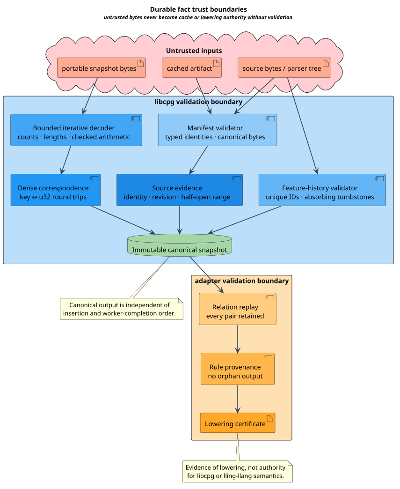

# libcpg Manifest and Fact-Identity Trust Model

This document defines the adversarial assumptions and mandatory controls for
libcpg extraction manifests, durable fact keys, source evidence, caches, and
adapter lowering. It supplements the
[normative semantic contract](../optimization/libcpg-manifest-fact-contract.md).

## Security objectives

The system must prevent an untrusted or stale artifact from being treated as a
complete result for a different repository, parser, grammar, extractor, query,
feature history, schema, source, source revision, or semantic configuration. It
must also prevent dense-index confusion, feature-identity reuse, source-range
forgery, provenance loss, nondeterministic publication, and resource exhaustion.

The model does not claim that a digest authenticates a producer, that a valid
manifest makes an analysis sound, or that a source range proves authorship.
Authentication, reviewer attestations, negative controls, and exact-publication
authority belong to the Vinary assurance boundary.

## Assets

- durable repository, source, feature, schema, query, and fact identities;
- historical feature entries and tombstones;
- source bytes and exact range evidence;
- canonical portable fact snapshots;
- manifest-bound cache entries;
- fact-to-rule provenance relations and lowering certificates; and
- completeness, precision, limitation, and termination classifications.

## Trust boundaries



[PlantUML source](../diagrams/optimization/libcpg-fact-trust-boundaries.puml)

| Boundary | Untrusted input | Trusted control |
|---|---|---|
| Parser/extractor | Source bytes, parser tree, grammar output | Versioned parser, grammar, extractor, and configuration identities |
| Snapshot decoder | Counts, lengths, keys, ranges, relation tags | Bounded iterative decoder and canonical-schema identity |
| Cache | Cached manifest, digest bucket, artifact bytes | Full canonical manifest/key comparison and complete-result gate |
| Feature history | New names, states, and semantic definitions | Stable-ID uniqueness, retained history, absorbing tombstones |
| Adapter | Fact records, requested lowering profile | Exact input identities and many-to-many certificate replay |
| Runtime composition | Host and invocation metadata | Separate runtime envelope; no transfer of extraction authority |

## Threats and controls

### Identity substitution

An attacker may pair artifact bytes with a manifest from another repository or
source revision. Cache and export APIs compare every typed extraction dimension;
unknown or malformed coordinates reject reuse. Type-specific domain separators
prevent a parser digest from being interpreted as a schema or source identity.

### Digest collision and preimage ambiguity

A digest lookup is an accelerator, not the equality decision. Every cache hit
compares the complete canonical key bytes. Portable content digests bind a
versioned schema identifier, domain tag, and unambiguous length-delimited
preimage. Concatenating variable-length fields without lengths is forbidden.

The chosen cryptographic algorithm must be approved in the release policy and
implemented by a reviewed dependency. [NIST FIPS 180-4](https://csrc.nist.gov/pubs/fips/180-4/upd1/final)
specifies SHA-2 message digests. Digest equality still does not authenticate a
producer or reviewer.

### Rename confusion

Display repository names and source paths can change without changing semantic
identity. A rename is accepted only through an explicit old-ID-to-new-display
mapping. Path-string equality must not define durable identity, and a changed
source identity must not be disguised as a rename.

### Tombstone resurrection or identity reuse

A feature identifier can be renamed or tombstoned, but its semantics cannot be
reassigned. Revisions retain all historical identifiers. Tombstone-to-active
and same-ID/different-semantics transitions are rejected before cache access or
export.

### Dense-index confusion

Dense identifiers are snapshot-local. Importers validate both durable-to-dense
and dense-to-durable round trips and reject duplicates, gaps, overflow beyond
`u32`, or references outside the declared fact count. Portable formats never
use a dense identifier without its bound snapshot identity.

### Source-range forgery

Byte ranges are half-open and checked with overflow-safe arithmetic:

```math
0\le b_s\le b_e\le N.
```

The source identity and revision must match the manifest. Line and column
coordinates cannot override invalid byte offsets. Synthetic facts carry a
typed reason and no fabricated source span.

### Stale or incomplete cache promotion

Cache reuse requires an exactly compatible manifest, a known comparison,
complete coverage, valid evidence, and a valid feature transition. Hash-bucket
matches, partial source equality, approximate precision, timeouts, and
cancellation are insufficient. Incomplete non-observation is `Unknown`, never
`Absent`.

The separation of dependency identity from rebuild policy follows the
incremental-systems analysis of
[Mokhov, Mitchell & Peyton Jones 2018](https://doi.org/10.1145/3236774).

### Provenance deletion or fabricated one-to-one lowering

The adapter must preserve the full relation $`L\subseteq F\times R`$. Every
emitted rule has at least one fact witness, and every selected relation pair is
retained. Deduplicating rules may merge provenance sets but cannot discard them.
The provenance interpretation is consistent with the relational framework of
[Green, Karvounarakis & Tannen 2007](https://doi.org/10.1145/1265530.1265535).

### Nondeterministic parallel publication

Workers produce local buffers keyed only by durable identities. Ordered commit
sorts or consumes canonical keys before dense assignment. Worker count,
scheduling, hash-map iteration, and completion order cannot enter portable
bytes. A failed worker makes the selected coverage incomplete; remaining worker
output cannot be silently promoted.

### Resource exhaustion

Before allocation, decoders validate:

- manifest byte length and field count;
- feature-history and tombstone counts;
- fact, relation, string, and source-evidence counts;
- aggregate payload and source-range bytes;
- dense identifier fit in `u32`;
- canonicalization and duplicate-check work budgets; and
- adapter relation-pair and witness limits.

All arithmetic is checked. Input-depth state is stored in bounded heap vectors,
queues, or tapes. Native recursion over manifests, facts, histories, or relation
pairs is forbidden. Overflow storage is repository-backed and explicitly
configured; tmpfs-backed `/tmp` is forbidden.

### Information disclosure

Durable keys should encode or hash typed stable identities, not raw absolute
paths, user names, host names, or source snippets. Source text is exported only
under explicit policy. Diagnostics may identify a rejected coordinate without
printing its sensitive preimage.

## Failure behavior

Malformed, stale, over-budget, unsupported, cancelled, and incomplete inputs
return distinct typed outcomes. None is translated to absence or exact success.
Decoding and validation are atomic: a rejected snapshot produces no partially
published cache entry, feature revision, dense table, or lowering certificate.

## Verification obligations

Release requires all of these controls to have independent evidence:

- unbounded Rocq proofs for ownership, identity, cache, history, source,
  export, lowering, dependency, and stack/work laws;
- TLC exploration of every lifecycle scenario and a killed mutant for every
  safety/liveness property;
- Z3 rejection of finite forbidden states plus constructive valid witnesses;
- property and mutation tests against the production implementation;
- malformed-input, collision-bucket, stale-revision, duplicate-key,
  tombstone-reactivation, incomplete-absence, and provenance-loss fixtures;
- small-native-stack and peak-RSS tests under the campaign resource envelope;
- serial/parallel byte-equivalence across worker counts and completion orders;
  and
- documentation, dependency-cycle, release-provenance, and anchored-bug gates.

Passing these obligations demonstrates conformance to this contract. It does
not independently prove the semantic soundness of every libcpg analysis or the
trustworthiness of a producer.

## References

- Mokhov, A., Mitchell, N., & Peyton Jones, S. (2018). *Build Systems à la
  Carte.* [Canonical DOI](https://doi.org/10.1145/3236774).
- Green, T. J., Karvounarakis, G., & Tannen, V. (2007). *Provenance
  Semirings.* [Canonical DOI](https://doi.org/10.1145/1265530.1265535).
- National Institute of Standards and Technology. (2015). *Secure Hash
  Standard.* [FIPS PUB 180-4](https://csrc.nist.gov/pubs/fips/180-4/upd1/final).
