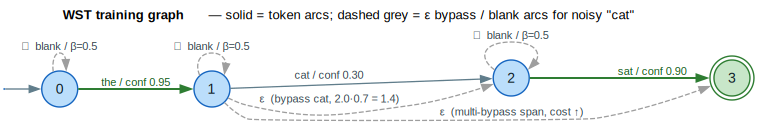

# Weakly Supervised Training (WST)

Weakly Supervised Training enables training speech recognition and sequence transduction models from imperfect transcripts. Instead of assuming ground-truth labels are correct, WST introduces flexibility through *bypass arcs* that allow the training algorithm to skip unreliable tokens.

## Motivation

Real-world training data often contains errors:

- **Crowd-sourced transcripts** may have typos or mishearings
- **OCR-generated text** contains character recognition errors
- **Machine-generated labels** from upstream ASR systems are imperfect
- **Historical data** may have transcription inconsistencies

Traditional training methods treat transcripts as ground truth, forcing the model to fit errors. WST allows the model to *selectively ignore* tokens it finds acoustically implausible, leading to more robust training.

## Core Concepts

### Standard vs. WST Training Graphs

A standard training graph enforces exact sequence matching:

```
Standard Graph (must match exactly):

    ─────[a]─────[b]─────[c]─────
   (0)         (1)         (2)         (3)
```

A WST graph adds **bypass arcs** for low-confidence tokens. The diagram below
shows the graph for a noisy transcript `"the cat sat"` where `"cat"` is unreliable
(confidence `0.30`): a single-token bypass `ε`-arc skips it, a multi-token bypass
spans further, and blank self-loops absorb timing slack (`build_wst_graph`,
`src/training/weak_supervision.rs`).



*Bold green arcs are the confident tokens (`the`, `sat`); the plain arc is the low-confidence `cat`; dashed grey arcs are the `ε` token-bypass, the multi-token-span bypass, and the blank self-loops. The single-token bypass weight is `token_bypass_weight · (1 − confidence) = 2.0 · 0.7 = 1.4`.*

<details><summary>Text view</summary>

```text
WST Graph (flexible matching):

              ┌──────── ε ────────┐
              │                   │
              ▼                   │
    ─────[a]─────[b]─────[c]─────
   (0)         (1)         (2)         (3)
              │     │
              │     └──── ε ────► (3)
              │
              └──────── ε ──────► (2)
```

</details>

The epsilon (`ε`) arcs allow skipping tokens. Each bypass arc carries a weight
that penalizes its use — higher penalty for skipping tokens the system is more
confident about.

### Bypass Arc Types

**Token Bypass Arcs**: Skip unreliable tokens entirely via ε-transitions.

The bypass weight scales with the confidence deficit:
`weight = token_bypass_weight · (1 − confidence)`. For `confidence = 0.3` and the
default `token_bypass_weight = 2.0`, that is `2.0 · 0.7 = 1.4`.

```rust
// Token with low confidence gets a bypass arc
let token = ConfidentToken::new(label, 0.3);  // 30% confidence

// Bypass weight scales with confidence deficit:
// weight = token_bypass_weight * (1.0 - confidence)
// For confidence=0.3: weight = 2.0 * 0.7 = 1.4
```

**Blank Bypass Arcs**: Self-loops that allow extra blank frames for timing flexibility.

```rust
// Every state gets a blank self-loop
// Handles timing uncertainties in acoustic alignment
//
//     ┌─[BLANK]─┐
//     │         │
//     ▼         │
//    (s) ───────┘
```

**Multi-Token Bypass Arcs**: Skip spans of consecutive unreliable tokens.

```rust
// When multiple consecutive tokens are unreliable,
// a single bypass can skip the entire span
//
// config.max_bypass_span = 3 allows:
//   State 0 ──ε──► State 2 (skip 1 token)
//   State 0 ──ε──► State 3 (skip 2 tokens)
//   State 0 ──ε──► State 4 (skip 3 tokens)
```

### Confidence Scores

Each token carries a confidence score between 0.0 and 1.0:

| Confidence | Interpretation | Bypass Behavior |
|------------|----------------|-----------------|
| 0.9 - 1.0  | Highly reliable | No bypass arc added |
| 0.5 - 0.9  | Moderate confidence | Bypass arc with moderate weight |
| 0.0 - 0.5  | Unreliable | Bypass arc with low weight (cheap to skip) |

The `confidence_threshold` configuration determines when bypass arcs are added:

```rust
let config = WstConfig {
    confidence_threshold: 0.5,  // Add bypass if confidence < 0.5
    token_bypass_weight: 2.0,   // Base penalty for bypassing
    ..Default::default()
};
```

## API Reference

### Configuration

```rust
pub struct WstConfig {
    /// Cost for using token bypass arcs (default: 2.0)
    pub token_bypass_weight: f64,

    /// Cost for using blank bypass arcs (default: 0.5)
    pub blank_bypass_weight: f64,

    /// Confidence below which bypass arcs are added (default: 0.5)
    pub confidence_threshold: f64,

    /// Maximum consecutive tokens to bypass (default: 3)
    pub max_bypass_span: usize,

    /// Allow deletion of any token regardless of confidence (default: false)
    pub allow_universal_bypass: bool,

    /// Weight for universal bypass (default: 5.0)
    pub universal_bypass_weight: f64,
}
```

### Token Representation

```rust
pub struct ConfidentToken {
    /// Token identifier
    pub label: Label,

    /// Confidence score (0.0 to 1.0)
    pub confidence: f64,

    /// Alternative tokens with their confidences
    pub alternatives: Vec<(Label, f64)>,
}

impl ConfidentToken {
    /// Create a token with confidence
    pub fn new(label: Label, confidence: f64) -> Self;

    /// Create a token with alternatives
    pub fn with_alternatives(
        label: Label,
        confidence: f64,
        alternatives: Vec<(Label, f64)>,
    ) -> Self;
}
```

### Graph Construction

**Basic WST Graph**:

```rust
use lling_llang::training::{build_wst_graph, WstConfig, ConfidentToken};
use lling_llang::semiring::LogWeight;

// Define tokens with confidence scores
let targets = vec![
    ConfidentToken::new(1, 0.95),  // "the" - high confidence
    ConfidentToken::new(2, 0.30),  // "cat" - low confidence (maybe "bat"?)
    ConfidentToken::new(3, 0.88),  // "sat" - high confidence
];

let config = WstConfig::default();
let graph: VectorWfst<Label, LogWeight> = build_wst_graph(&targets, &config);
```

**Uniform Confidence** (when scores unavailable):

```rust
use lling_llang::training::build_wst_graph_uniform;

let targets = vec![1, 2, 3, 4];  // Just label IDs
let default_confidence = 0.7;    // Treat all as moderately reliable

let graph: VectorWfst<Label, LogWeight> = build_wst_graph_uniform(
    &targets,
    default_confidence,
    &WstConfig::default(),
);
```

**With Insertions** (for incomplete transcripts):

```rust
use lling_llang::training::build_wst_graph_with_insertions;

// When transcript may be missing words
let graph: VectorWfst<Label, LogWeight> = build_wst_graph_with_insertions(
    &targets,
    vocab_size,        // Allow inserting any vocabulary item
    insertion_weight,  // Penalty for insertions
    &config,
);
```

### Loss Computation

```rust
use lling_llang::training::{wst_loss, WstLossResult};

// Acoustic scores: [time_frames][vocab_size]
// Higher (less negative) = more likely
let acoustic_scores: Vec<Vec<f64>> = vec![
    vec![-0.1, -2.0, -3.0, -4.0],  // Frame 0: label 0 most likely
    vec![-3.0, -0.2, -2.0, -4.0],  // Frame 1: label 1 most likely
    vec![-4.0, -3.0, -0.1, -2.0],  // Frame 2: label 2 most likely
];

let result: WstLossResult = wst_loss(&acoustic_scores, &graph);

println!("Loss: {}", result.loss);
println!("Bypass ratio: {:.2}%", result.bypass_ratio * 100.0);
println!("Alignment length: {}", result.alignment.len());
```

### Loss Result Structure

```rust
pub struct WstLossResult {
    /// Total loss (negative log probability)
    pub loss: f64,

    /// Best path through the graph (for debugging)
    pub alignment: Vec<WstAlignmentStep>,

    /// Fraction of steps that used bypass arcs
    pub bypass_ratio: f64,
}

pub struct WstAlignmentStep {
    /// Position in target sequence
    pub target_pos: usize,

    /// Emitted label (0 for bypass/blank)
    pub label: Label,

    /// Whether this step used a bypass arc
    pub is_bypass: bool,

    /// Arc weight used
    pub weight: f64,
}
```

## Examples

### Training with Mixed-Quality Transcripts

```rust
use lling_llang::training::{build_wst_graph, wst_loss, WstConfig, ConfidentToken};
use lling_llang::semiring::LogWeight;

// Transcript: "the quick brown fox"
// But "quick" was hard to hear, might be "thick"
let targets = vec![
    ConfidentToken::new(word_id("the"), 0.95),
    ConfidentToken::with_alternatives(
        word_id("quick"), 0.45,
        vec![(word_id("thick"), 0.40)],  // Alternative hypothesis
    ),
    ConfidentToken::new(word_id("brown"), 0.90),
    ConfidentToken::new(word_id("fox"), 0.92),
];

let config = WstConfig {
    confidence_threshold: 0.5,
    token_bypass_weight: 2.0,
    blank_bypass_weight: 0.5,
    max_bypass_span: 2,
    ..Default::default()
};

let graph: VectorWfst<Label, LogWeight> = build_wst_graph(&targets, &config);

// During training, compute loss against acoustic features
let result = wst_loss(&acoustic_scores, &graph);

// If acoustics strongly suggest "thick", the model can bypass "quick"
// with relatively low penalty (confidence deficit = 0.55)
```

### Estimating Confidence from N-best Lists

When you have ASR n-best output, you can estimate per-token confidence:

```rust
use lling_llang::training::estimate_confidences_from_nbest;

// N-best hypotheses with probabilities
let nbest = vec![
    (vec!["the", "cat", "sat"], 0.6),   // Best hypothesis
    (vec!["the", "bat", "sat"], 0.25),  // Second best
    (vec!["a", "cat", "sat"], 0.15),    // Third
];

let reference = vec!["the", "cat", "sat"];

// Estimates confidence per position based on agreement across n-best
let confidences = estimate_confidences_from_nbest(&nbest, &reference);
// confidences ≈ [0.75, 0.60, 1.0]
//   "the": appears in 2/3 hypotheses (0.6 + 0.15)
//   "cat": appears in 2/3 hypotheses (0.6 + 0.15)
//   "sat": appears in all hypotheses (0.6 + 0.25 + 0.15)
```

### Interpreting Bypass Ratio

The `bypass_ratio` metric indicates transcript quality:

```rust
let result = wst_loss(&acoustic_scores, &graph);

match result.bypass_ratio {
    r if r < 0.05 => println!("Excellent transcript quality"),
    r if r < 0.15 => println!("Good quality, minor issues"),
    r if r < 0.30 => println!("Moderate quality, significant bypassing"),
    _ => println!("Poor quality, consider re-transcribing"),
}
```

A high bypass ratio during training suggests:
1. The transcript may have errors
2. The acoustic model is confident about different tokens
3. The data point may need manual review

## Advanced Topics

### Lattice-Free MMI (LF-MMI)

**LF-MMI** (Lattice-Free Maximum Mutual Information) is the sibling
sequence-discriminative objective in this module (`src/training/lfmmi.rs`,
[Povey 2016](../BIBLIOGRAPHY.md#ref-povey2016)). Where WST relaxes a *single* noisy
reference path with bypass arcs, LF-MMI contrasts the **numerator** graph (the
correct transcript) against a **denominator** graph (a phone loop + LM covering
*all* hypotheses), so the competing-hypothesis lattice is never materialized —
hence "lattice-free". The objective is
`L_MMI = −( log P_num(x) − log P_den(x) )`, warm-started by cross-entropy
regularization for stability.


*Purple = acoustic posteriors `log P(pdf∣frame)`; orange = the numerator / denominator graphs (`build_numerator_graph` / `build_denominator_graph`); green = their forward-backward scores; the amber node is the MMI objective and the red node is the warmup / regularization interpolation (`xent_regularize`, `l2_regularize`, `leaky_hmm_coefficient` in `LfMmiConfig`).*

<details><summary>Text view</summary>

```text
                 acoustic posteriors  log P(pdf | frame)
                    │                              │
        forward-backward                   forward-backward
                    ▼                              ▼
        numerator graph                  denominator graph
        (correct transcript)             (phone loop + LM, all hyps)
                    │                              │
            log P_num(x)                    log P_den(x)
                    └──────────────┬───────────────┘
                                   ▼
              L_MMI = −( log P_num − log P_den )
                                   │
                + xent_regularize · L_xent   (warmup)
                + l2_regularize   · ‖out‖²
                + leaky_hmm_coefficient
                                   ▼
              gradients  ∂L / ∂(acoustic scores)
```

</details>

```rust
use lling_llang::training::{
    lfmmi_loss, build_numerator_graph, build_denominator_graph,
    HmmTopology, LfMmiConfig,
};
use lling_llang::semiring::LogWeight;

// HMM topology: num_phones phones, 1 PDF-emitting state each (chain topology)
let topo = HmmTopology::new(/* num_phones */ 10, /* states_per_phone */ 1);
let pdf_to_phone: Vec<u32> = (0..10).collect();

// Numerator: the reference transcript; Denominator: phone loop (no phone LM)
let numerator: VectorWfst<u32, LogWeight>   = build_numerator_graph(&transcript, &pdf_to_phone, &topo);
let denominator: VectorWfst<u32, LogWeight> = build_denominator_graph(10, &topo, None);

// MMI loss with cross-entropy warmup (xent_regularize) for early-training stability
let config = LfMmiConfig::default();
let result = lfmmi_loss(&acoustic_scores, &numerator, &denominator, &config);
println!("MMI loss: {}  (num {} − den {})",
    result.loss, result.numerator_log_prob, result.denominator_log_prob);
```

### Integration with CTC Training

WST graphs can be combined with CTC topologies:

```rust
use lling_llang::ctc::compact_ctc;
use lling_llang::training::build_wst_graph;
use lling_llang::composition::compose;

// Build CTC topology (allows repetitions and blanks)
let ctc = compact_ctc::<LogWeight>(vocab_size);

// Build WST constraint graph
let wst = build_wst_graph(&targets, &config);

// Compose: CTC structure with WST flexibility
let training_graph = compose(ctc, wst);
```

### Confidence Estimation Strategies

Several approaches for estimating token confidence:

1. **N-best Agreement**: Tokens appearing in multiple hypotheses get higher confidence
2. **Posterior Probability**: Use per-frame acoustic posteriors
3. **Language Model Perplexity**: Unlikely n-grams get lower confidence
4. **External Classifier**: Train a model to predict transcript reliability

### Numerical Stability

The forward-backward algorithm uses log-domain arithmetic for numerical stability:

```rust
// Internal log-addition: log(exp(a) + exp(b))
fn log_add(a: f64, b: f64) -> f64 {
    if a == f64::NEG_INFINITY { return b; }
    if b == f64::NEG_INFINITY { return a; }
    let (max, min) = if a > b { (a, b) } else { (b, a) };
    max + (min - max).exp().ln_1p()
}
```

This prevents underflow when multiplying many small probabilities.

## Related Documentation

- [Differentiable Operations](../advanced/differentiable.md) - Gradient computation through WFSTs
- [Top-Down Autograd](../advanced/topdown-autograd.md) - k2-style efficient gradients
- [CTC Topologies](../advanced/ctc-topologies.md) - CTC graph structures for training

## References

- [Gao 2025](../BIBLIOGRAPHY.md#ref-gao2025) — *WST: Weakly Supervised Transducer
  for Automatic Speech Recognition.* The bypass-arc training graph this document
  implements.
- [Povey 2016](../BIBLIOGRAPHY.md#ref-povey2016) — *Purely Sequence-Trained Neural
  Networks for ASR Based on Lattice-Free MMI.* The numerator/denominator LF-MMI
  objective and cross-entropy warmup.
- [Graves 2006](../BIBLIOGRAPHY.md#ref-graves2006) — *Connectionist Temporal
  Classification.* The CTC topology composed with the WST/LF-MMI graphs for
  training (`blank` units, repetition handling).
