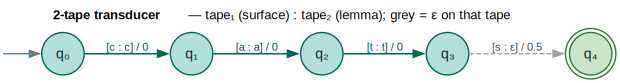
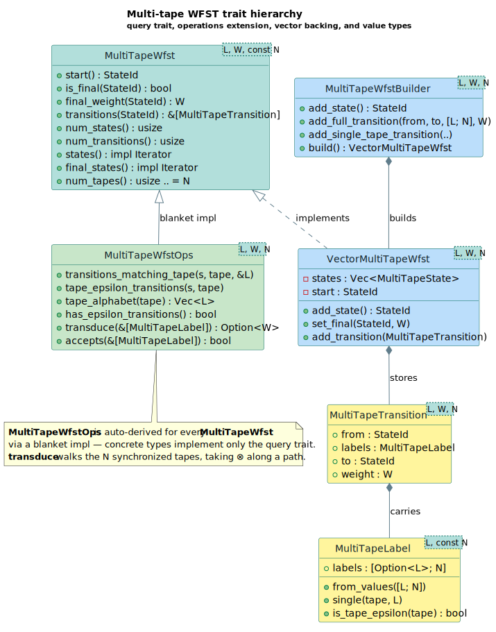

# Multi-Tape Weighted Transducers

A **multi-tape weighted finite-state transducer (WFST)** reads and writes `N`
synchronized streams at once — one symbol (or `ε`) per tape on every transition —
so a single automaton can relate, for example, a surface word, its lemma, and a
morphological tag in lock-step. This generalizes the familiar two-tape
(input/output) transducer of [Mohri 1997](../BIBLIOGRAPHY.md#ref-mohri1997) to
`k ≥ 1` tapes; the implementation lives in
[`src/multitape/`](../../src/multitape/).

---

## Terms & symbols

All cross-cutting notation is defined centrally in
[`NOTATION.md`](../NOTATION.md); the **WFST** acronym (Weighted Finite-State
Transducer) is expanded there. The terms used locally in this document:

| Symbol / term | Meaning |
|---|---|
| `N` | Number of tapes (a Rust `const N: usize` generic). |
| `Σᵢ` | Alphabet of tape `i` (`1 ≤ i ≤ N`); all tapes share one Rust label type `L`. |
| `Q` | Finite set of states. |
| `q₀` | Start state (`start()`). |
| `F ⊆ Q` | Final states (`final_states()`). |
| `E` | Transition set; each arc carries an `N`-vector of labels and a weight. |
| `ρ` | Final-weight function `ρ : F → K` (`final_weight()`). |
| `K` | The carrier set of the weight semiring `W` (see [Semirings](../architecture/semirings.md)). |
| `⊗` | Semiring *times* — combines weights **sequentially** along one path. |
| `⊕` | Semiring *plus* — combines weights of **alternative** paths. |
| `0̄`, `1̄` | The `⊕`-identity ("no path") and `⊗`-identity ("empty path"). |
| `ε` | The empty label — a tape that neither reads nor writes on this arc. |
| `aᵢ` | The label on tape `i`; `aᵢ ∈ Σᵢ ∪ {ε}`. |
| **tape delay** | How many symbols one tape is ahead of the lagging tape (`TapeDelay`). |

---

## Formal model

A `k`-tape weighted transducer is the tuple

`` `T = (Q, Σ₁,…,Σₖ, q₀, F, E, ρ)` ``

whose components are:

| Component | Type | Role |
|---|---|---|
| `Q` | finite set | States. |
| `Σ₁,…,Σₖ` | `k` alphabets | One symbol set per tape. |
| `q₀ ∈ Q` | state | Start state. |
| `F ⊆ Q` | state subset | Final (accepting) states. |
| `E` | relation | Arcs `(q, (a₁,…,aₖ), w, q′)` with `aᵢ ∈ Σᵢ ∪ {ε}`, `w ∈ K`, `q,q′ ∈ Q`. |
| `ρ` | `F → K` | Final weight contributed by ending in a final state. |

The weight a path contributes is the `⊗`-product of its arc weights, closed by
the final weight: a path `π = e₁ e₂ … eₘ` from `q₀` to a final state `q` has
weight

`` `w(π) = w(e₁) ⊗ w(e₂) ⊗ ⋯ ⊗ w(eₘ) ⊗ ρ(q)` ``.

The weight a transducer assigns to a tuple of strings `(s₁,…,sₖ)` is the `⊕`-sum
over **all** accepting paths whose tape-`i` projection spells `sᵢ`:

```text
T(s₁,…,sₖ) = ⊕ { w(π) ∣ π is accepting and projᵢ(π) = sᵢ for all i }.
```

A transition reads a symbol on tape `i` only where `aᵢ ≠ ε`; an arc that is `ε`
on **every** tape is a pure `ε`-move (it changes state and accrues weight while
consuming nothing). Because each tape may independently idle on `ε`, the tapes
can drift out of alignment — the [synchronization](#synchronization-bounding-tape-delay)
section below bounds that drift.

> **Two tapes is the classic case.** With `N = 2`, `Σ₁` is the input alphabet,
> `Σ₂` the output alphabet, and `T` is exactly the input/output WFST of
> [Mohri 1997](../BIBLIOGRAPHY.md#ref-mohri1997). The `two_tape_transducer()`
> constructor is a thin alias for this `N = 2` specialization.

---

## Intuition: a 2-tape lemmatizer

Before the general theory, a tiny worked example. We want a 2-tape transducer
that pairs the surface word `cats` (tape₁) with its lemma `cat` (tape₂): the
letters `c`, `a`, `t` are copied on both tapes, and the plural `s` is read on
tape₁ while tape₂ emits `ε` (the lemma drops it). Each arc is written
`` `[a₁ : a₂] / w` ``.

```text
       [c:c]/0      [a:a]/0      [t:t]/0      [s:ε]/0.5
  q₀ ───────────▶ q₁ ─────────▶ q₂ ─────────▶ q₃ ─ ─ ─ ─ ─ ▶ (q₄)
```

Reading the tuple `(cats, cat)` traverses the single path `q₀→q₁→q₂→q₃→q₄`; in
the Tropical semiring (`⊗ = +`, `1̄ = 0`) its weight is
`` `0 + 0 + 0 + 0.5 = 0.5` ``. The `[s:ε]` arc is the crux: tape₁ advances while
tape₂ stays put, so after it the tapes differ in length by one — a **delay of 1**.

This is the diagram rendered in the [Diagrams](#diagrams) section.

---

## Architecture & API

The module is organized around one **query trait**, one **operations
extension**, a concrete vector backing, and a builder.

| Item | Kind | Responsibility |
|---|---|---|
| [`MultiTapeWfst<L, W, const N>`](../../src/multitape/traits.rs) | trait | Read-only structural queries: `start`, `is_final`, `final_weight`, `transitions`, `states`, `num_tapes`. |
| [`MultiTapeWfstOps<L, W, N>`](../../src/multitape/traits.rs) | trait (blanket) | Higher-level ops layered on the query trait: per-tape filtering, `tape_alphabet`, `transduce`, `accepts`. |
| [`VectorMultiTapeWfst<L, W, N>`](../../src/multitape/vector.rs) | struct | The default in-memory implementation (states in a `Vec`, arcs per state). |
| [`MultiTapeState<L, W, N>`](../../src/multitape/vector.rs) | struct | One state: `is_final`, `final_weight`, and its outgoing `transitions`. |
| [`MultiTapeWfstBuilder<L, W, N>`](../../src/multitape/builder.rs) | struct | Ergonomic construction with chaining; `build()` yields a `VectorMultiTapeWfst`. |
| [`MultiTapeLabel<L, const N>`](../../src/multitape/label.rs) | struct | An `[Option<L>; N]` tape-label vector (`None` = `ε`). |
| [`MultiTapeTransition<L, W, N>`](../../src/multitape/transition.rs) | struct | An arc `{ from, labels, to, weight }`. |
| [`project`](../../src/multitape/project.rs) / [`project_tapes`](../../src/multitape/project.rs) | fn | Keep one tape (→ single-tape `VectorWfst`) or a subset of tapes (→ smaller multi-tape WFST). |
| [`synchronize`](../../src/multitape/synchronize.rs) / [`TapeDelay`](../../src/multitape/synchronize.rs) | fn / struct | Bound the inter-tape delay (see below). |

`MultiTapeWfstOps` is implemented for **every** `MultiTapeWfst` through a blanket
`impl`, so a concrete type only ever needs to satisfy the small query trait:

```rust
// Blanket implementation — from src/multitape/traits.rs
impl<T, L, W, const N: usize> MultiTapeWfstOps<L, W, N> for T
where
    T: MultiTapeWfst<L, W, N>,
    L: Clone + Eq + std::hash::Hash + Send + Sync,
    W: lling_llang::semiring::Semiring + Clone,
{
}
```

The trait relationships, the value types each arc carries, and the
builder→implementation pipeline are drawn in the
[trait-hierarchy diagram](#trait-hierarchy).

### The multi-tape label

A `MultiTapeLabel<L, N>` is the heart of the design: a fixed-size array of
`Option<L>`, where `None` is `ε` on that tape. Its constructors cover the common
shapes — all `ε` (`epsilon`), all non-`ε` (`from_values`), exactly one non-`ε`
tape (`single`), or exactly two (`pair`):

```rust
use lling_llang::multitape::MultiTapeLabel;

// All three tapes carry a symbol: [a, b, c].
let full = MultiTapeLabel::from_values(['a', 'b', 'c']);
assert_eq!(full.non_epsilon_count(), 3);

// Only tape 1 is non-ε: [ε, x, ε].
let one: MultiTapeLabel<char, 3> = MultiTapeLabel::single(1, 'x');
assert!(one.is_tape_epsilon(0));
assert!(!one.is_tape_epsilon(1));
assert!(one.is_tape_epsilon(2));
```

---

## Algorithms

### Transduction (running the tapes)

`MultiTapeWfstOps::transduce` answers: *given a sequence of multi-tape labels,
is there an accepting path that spells them, and what is its `⊗`-weight?* It is a
depth-first search that matches the next label, falling back to `ε`-moves, and
multiplies arc weights along the way. The loop invariant is that
`transduce_from(state, input)` returns the weight of some accepting path that
consumes exactly `input` starting at `state`, or `0̄`-as-`None` if none exists.

```text
⟨ transduce from a state ⟩ ≡
  if input is empty then
      if state ∈ F then return Some(ρ(state))
      for each arc e from state with label = all-ε:           ⟨ trailing ε-moves ⟩
          if Some(w) ← transduce_from(e.to, input) then return Some(e.weight ⊗ w)
      return None
  let (head, tail) = (input[0], input[1..])
  for each arc e from state with e.labels = head:             ⟨ consume one label ⟩
      if Some(w) ← transduce_from(e.to, tail) then return Some(e.weight ⊗ w)
  for each arc e from state with label = all-ε:               ⟨ ε without consuming ⟩
      if Some(w) ← transduce_from(e.to, input) then return Some(e.weight ⊗ w)
  return None
```

The three named chunks correspond one-to-one with the three loops in
[`traits.rs`](../../src/multitape/traits.rs). The chunk
`` ⟨ consume one label ⟩ `` matches a full `N`-tuple label against `input[0]`;
`` ⟨ ε without consuming ⟩ `` follows pure `ε`-moves so the search can change
state without advancing the input cursor.

**Complexity.** This returns the *first* accepting path it finds (a recognition
short-circuit), not the `⊕`-sum over all of them; in the worst case it explores
`` `O(∣E∣)` `` arcs per input position for `` `O(∣input∣ · ∣E∣)` `` work, and it
assumes the `ε`-arcs do not form a cycle (otherwise the recursion may not
terminate). For full `⊕`-aggregation use the single-tape shortest-distance
machinery after [projection](#projection).

### Projection

Projection collapses a multi-tape WFST onto fewer tapes. `project(&t, i)` keeps
**only** tape `i` and yields an ordinary single-tape
[`VectorWfst`](../architecture/wfst-traits.md) (`π_i` in the notation of
[`NOTATION.md`](../NOTATION.md)): states map 1-to-1, finals and the start are
preserved, and each arc is relabeled with its tape-`i` symbol (an `ε` on that
tape becomes an `ε`-arc). `project_tapes(&t, [i, j, …])` instead keeps a subset,
producing a smaller `VectorMultiTapeWfst<L, W, M>`.

### Synchronization (bounding tape delay)

Because tapes may idle on `ε`, one tape can race ahead of another. The
[`TapeDelay<N>`](../../src/multitape/synchronize.rs) state tracks, after each
consumed label, how far ahead each tape is, **normalized so the lagging tape is
0**. A transducer has *bounded delay* `d` if no reachable `TapeDelay` ever has
`max − min > d`:

| Function | Returns | Meaning |
|---|---|---|
| `compute_max_delay(&t)` | `usize` | The largest delay reachable from `q₀`. |
| `has_bounded_delay(&t, d)` | `bool` | Whether every reachable delay is `≤ d`. |
| `synchronize(&t, cfg)` | `SynchronizedMultiTape` | A rebuilt WFST whose states are `(original state, delay)` pairs, dropping any arc that would exceed `cfg.max_delay`. |

`synchronize` is a worklist construction: it explores `(state, delay)` pairs from
the start, and for each outgoing arc computes the successor delay
(`delay.consume(&arc.labels)`); arcs whose successor delay violates the bound are
pruned, so the result accepts exactly the bounded-delay sublanguage of the input.
This is the multi-tape analogue of the single-tape
[synchronization algorithm](../algorithms/synchronization.md).

---

## Examples

### Build a 2-tape transducer and run it

```rust
use lling_llang::multitape::{MultiTapeWfstBuilder, MultiTapeLabel, MultiTapeWfstOps};
use lling_llang::semiring::{Semiring, TropicalWeight};

let mut builder = MultiTapeWfstBuilder::<char, TropicalWeight, 2>::new();
let s0 = builder.add_state();
let s1 = builder.add_state();
builder
    .set_start(s0)
    .set_final(s1, TropicalWeight::one())
    .add_transition(s0, s1, MultiTapeLabel::from_values(['a', 'x']), TropicalWeight::one());
let mt = builder.build();

// The tuple (a, x) is accepted; (b, y) is not.
assert!(mt.accepts(&[MultiTapeLabel::from_values(['a', 'x'])]));
assert!(!mt.accepts(&[MultiTapeLabel::from_values(['b', 'y'])]));
```

### A 3-tape word-alignment transducer

The third tape carries an alignment tag, so one automaton relates a source word,
a target word, and how they align — a parallel-corpus use case from the module
docs:

```rust
use lling_llang::multitape::{MultiTapeWfstBuilder, MultiTapeWfst};
use lling_llang::semiring::{Semiring, TropicalWeight};

let mut builder: MultiTapeWfstBuilder<&str, TropicalWeight, 3> =
    MultiTapeWfstBuilder::new();
let s0 = builder.add_state();
let s1 = builder.add_state();
let s2 = builder.add_state();
let s3 = builder.add_final_state(TropicalWeight::one());
builder.set_start(s0);

// tape 0 = source, tape 1 = target, tape 2 = alignment tag.
builder.add_full_transition(s0, s1, ["the", "le", "A"], TropicalWeight::new(1.0));
builder.add_full_transition(s1, s2, ["cat", "chat", "A"], TropicalWeight::new(1.0));
builder.add_full_transition(s2, s3, ["sleeps", "dort", "A"], TropicalWeight::new(1.0));

let wfst = builder.build();
assert_eq!(wfst.num_tapes(), 3);
assert_eq!(wfst.num_transitions(), 3);
```

### Project onto one tape

```rust
use lling_llang::multitape::{MultiTapeWfstBuilder, MultiTapeLabel, project};
use lling_llang::semiring::{Semiring, TropicalWeight};
use lling_llang::wfst::Wfst;

let mut builder = MultiTapeWfstBuilder::<char, TropicalWeight, 3>::new();
let s0 = builder.add_state();
let s1 = builder.add_final_state(TropicalWeight::one());
builder.set_start(s0);
builder.add_transition(
    s0, s1,
    MultiTapeLabel::from_values(['a', 'x', '1']),
    TropicalWeight::one(),
);
let mt = builder.build();

// Keep tape 1 only: the single-tape WFST is labeled with 'x'.
let projected = project(&mt, 1);
assert_eq!(projected.wfst().transitions(0)[0].input, Some('x'));
```

### Check and bound tape delay

```rust
use lling_llang::multitape::{
    MultiTapeWfstBuilder, MultiTapeLabel, has_bounded_delay, compute_max_delay,
    synchronize, SyncConfig, MultiTapeWfst,
};
use lling_llang::semiring::{Semiring, TropicalWeight};

let mut builder = MultiTapeWfstBuilder::<char, TropicalWeight, 2>::new();
let s0 = builder.add_state();
let s1 = builder.add_state();
let s2 = builder.add_state();
let s3 = builder.add_final_state(TropicalWeight::one());
builder.set_start(s0);
// tape 0 advances twice before tape 1 catches up → delay reaches 2.
builder.add_transition(s0, s1, MultiTapeLabel::single(0, 'a'), TropicalWeight::one());
builder.add_transition(s1, s2, MultiTapeLabel::single(0, 'b'), TropicalWeight::one());
builder.add_transition(s2, s3, MultiTapeLabel::pair(0, 'c', 1, 'x'), TropicalWeight::one());
let mt = builder.build();

assert_eq!(compute_max_delay(&mt), 2);
assert!(!has_bounded_delay(&mt, 1));
assert!(has_bounded_delay(&mt, 2));

// Synchronizing with max_delay = 1 prunes the over-delayed arc.
let synced = synchronize(&mt, SyncConfig::new(1));
assert_eq!(synced.wfst().num_transitions(), 1);
```

---

## Diagrams

### 2-tape transducer



*Teal nodes/arcs = transducer states and tape pairs `[a₁:a₂]/w`; the green
double-ring is the final state; the grey dashed arc emits `ε` on tape₂ (lemma),
creating a tape delay of 1.*

<details><summary>Text view</summary>

```text
        [c:c]/0      [a:a]/0      [t:t]/0       [s:ε]/0.5
   q₀ ───────────▶ q₁ ─────────▶ q₂ ─────────▶ q₃ ─ ─ ─ ─ ─ ▶ ((q₄))
   start                                          (grey = ε on tape₂)

  tape₁ (surface):  c  a  t  s
  tape₂ (lemma):    c  a  t  ·     (· = ε; tapes now differ in length → delay 1)
```

</details>

### Trait hierarchy



*Teal = the core `MultiTapeWfst` query trait; green = the `MultiTapeWfstOps`
blanket extension; blue = the `VectorMultiTapeWfst` implementation and its
builder; amber = the `MultiTapeLabel`/`MultiTapeTransition` value types each arc
carries.*

<details><summary>Text view</summary>

```text
          ┌───────────────────────────────┐
          │ MultiTapeWfst<L,W,const N>     │  (query trait)
          │  start · is_final · final_wt   │
          │  transitions · states · num_tapes
          └───────────────┬───────────────┘
              blanket impl │            implements
          ┌───────────────┴────────┐   ┌────────────────────────────┐
          │ MultiTapeWfstOps<L,W,N>│   │ VectorMultiTapeWfst<L,W,N> │
          │  transduce · accepts    │   │  Vec<MultiTapeState>       │
          │  tape_alphabet · …      │   └──────────────┬─────────────┘
          └─────────────────────────┘     builds │     │ stores
                                   ┌─────────────┴┐   ┌─┴───────────────────────────┐
                                   │ MultiTape    │   │ MultiTapeTransition<L,W,N>  │
                                   │ WfstBuilder  │   │  from·labels·to·weight      │
                                   └──────────────┘   └─────────────┬───────────────┘
                                                          carries │
                                                  ┌───────────────┴────────────────┐
                                                  │ MultiTapeLabel<L,const N>      │
                                                  │  [Option<L>; N]  (None = ε)    │
                                                  └────────────────────────────────┘
```

</details>

---

## Relation to the library

- **Two-tape specialization.** `two_tape_transducer()` / `three_tape_transducer()`
  are `N = 2` / `N = 3` aliases; the `N = 2` case coincides with the ordinary
  input/output [WFST traits](../architecture/wfst-traits.md).
- **Projection bridges to single-tape algorithms.** `project` emits a
  [`VectorWfst`](../architecture/wfst-traits.md), after which every single-tape
  algorithm applies — [shortest distance](../algorithms/shortest-distance.md),
  [determinization](../algorithms/determinization.md),
  [path extraction](../algorithms/path-extraction.md).
- **Synchronization mirrors the single-tape operation.** The bounded-delay
  construction here is the multi-tape counterpart of
  [synchronization](../algorithms/synchronization.md) on two-tape transducers.
- **Weights are any semiring.** `W` ranges over the
  [semiring](../architecture/semirings.md) implementations (Tropical, Log,
  Probability, …); the examples use `TropicalWeight`.
- **No feature flag.** The module is always compiled (`pub mod multitape;` in
  [`src/lib.rs`](../../src/lib.rs)); its public surface is re-exported from the
  crate `prelude`.

See the [transducer-family overview](README.md) for how multi-tape transducers
compare with the pushdown, tree, subsequential, and neural transducer families.

---

## References

- <a id="cite-mohri1997"></a>[Mohri 1997](../BIBLIOGRAPHY.md#ref-mohri1997) —
  Mohri, M. (1997). *Finite-State Transducers in Language and Speech Processing.*
  Computational Linguistics 23(2):269–311. The foundational treatment of
  (two-tape) weighted transducers that multi-tape transducers generalize.
- <a id="cite-mohri2009"></a>[Mohri 2009](../BIBLIOGRAPHY.md#ref-mohri2009) —
  Mohri, M. (2009). *Weighted Automata Algorithms.* In *Handbook of Weighted
  Automata*, pp. 213–254. Springer. Semiring-parametric path and synchronization
  algorithms used after projection.
- <a id="cite-allauzen2007"></a>[Allauzen 2007](../BIBLIOGRAPHY.md#ref-allauzen2007) —
  Allauzen, C., Riley, M., Schalkwyk, J., Skut, W., & Mohri, M. (2007).
  *OpenFst: A General and Efficient Weighted Finite-State Transducer Library.*
  CIAA 2007. The transducer library whose two-tape design this module extends to
  `N` tapes.
