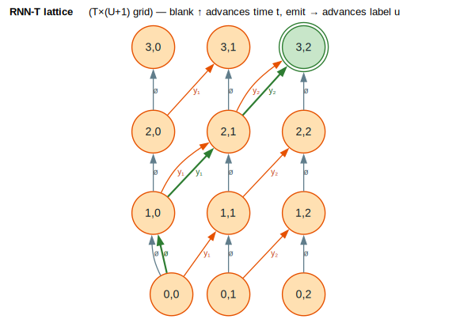

# Neural Transducer (RNN-T)

The **Recurrent Neural-network Transducer (RNN-T)** is the dominant streaming
architecture for production automatic speech recognition (ASR). It factors the
conditional probability `` `P(y∣x)` `` of a label sequence `y` given acoustic
features `x` into per-step **emit** and **blank** decisions over a `` `T×U` ``
alignment lattice, and marginalizes over *all* monotone alignments. This module
([`src/transducer/`](../../src/transducer/)) provides the WFST-shaped
infrastructure — the alignment lattice, a differentiable forward–backward loss,
and beam-search decoding — around the three learnable components (encoder,
predictor, joiner). The model follows
[Graves 2012](../BIBLIOGRAPHY.md#ref-graves2012).

---

## Terms & symbols

Shared notation is in [`NOTATION.md`](../NOTATION.md); **RNN-T** abbreviates
*Recurrent Neural-network Transducer*, **ASR** *Automatic Speech Recognition*,
and **LM** *Language Model*. Locally:

| Symbol / term | Meaning |
|---|---|
| `x` | Input acoustic feature sequence (e.g. mel spectrogram frames). |
| `y = y₁…y_U` | Output label (token) sequence of length `U`. |
| `T` | Number of encoder output frames (`EncoderOutput::num_frames`). |
| `U` | Target length; the lattice has `U+1` label positions `u ∈ {0,…,U}`. |
| `V` | Vocabulary size **including** the blank symbol (`vocab_size`). |
| `ø` / blank | The blank label (`BLANK = 0`); emitting it advances time without emitting a token. |
| `(t, u)` | A lattice node: `t` frames consumed, `u` tokens emitted. |
| `f_t` | Encoder output at frame `t` (`EncoderOutput::frame(t)`). |
| `g_u` | Predictor output at label position `u` (`PredictorOutput::position(u)`). |
| `α[t,u]` / `β[t,u]` | Forward / backward log-probabilities of reaching / completing `(t,u)`. |
| `⊕`, `⊗` | Semiring *plus* / *times*; here the **Log semiring** (`⊕ₗₒg`, `+`). |
| `⊕ₗₒg` | Log-add: `x ⊕ₗₒg y = ln(eˣ + eʸ)` — the operation `log_add` implements. |
| `λ` | Shallow-fusion LM weight. |

---

## Formal model

RNN-T defines a distribution over label sequences by summing the probability of
every **alignment** — every monotone staircase path through the `` `T×(U+1)` ``
grid from `(0,0)` to `(T,U)`. Writing `B` for the function that deletes blanks
from an alignment `a` to recover the label sequence,

`` `P(y∣x) = Σ over alignments a with B(a) = y of P(a∣x)` ``,

and the negative log-likelihood loss is `` `L = −ln P(y∣x)` ``. At node `(t,u)`
the joiner produces a distribution over the `V` symbols, factored into the
**blank** decision (advance time) and the **emit** decisions (output the next
token):

```text
P(a∣x) = Π over steps of  P(ø ∣ t,u)     for a blank step at (t,u)
                          P(y_{u+1} ∣ t,u) for an emit step at (t,u)
```

so each alignment is a product (`⊗`) of per-step probabilities, and `P(y∣x)` is
the `⊕`-sum (in the Log semiring, `⊕ₗₒg`) over alignments. Two transition kinds
generate every alignment:

| Step | Lattice move | Emits | Probability factor |
|---|---|---|---|
| **blank** | `(t, u) → (t+1, u)` | nothing | `P(ø ∣ t, u)` |
| **emit** | `(t, u) → (t+1, u+1)` | token `y_{u+1}` | `P(y_{u+1} ∣ t, u)` |

> **A note on geometry.** Graves' original lattice draws *blank* along the time
> axis and *emit* along the (orthogonal) label axis, so an emit need not consume a
> frame. This library's concrete `TransducerLattice::to_wfst` advances time on
> **both** kinds of arc — blank goes `(t,u)→(t+1,u)` and emit goes
> `(t,u)→(t+1,u+1)` — which yields a strictly monotone DAG (every arc increases
> `t`) that is convenient for shortest-distance and composition. The two views
> describe the same alignment set; the diagrams below use this library's
> frame-advancing convention and mark the emit arcs in orange.

---

## Intuition: aligning 3 frames to 2 tokens

Suppose the encoder yields `T = 3` frames and the target is `y = y₁ y₂`
(`U = 2`), so label positions are `u ∈ {0, 1, 2}`. A decode must consume all 3
frames while emitting both tokens; one valid alignment is

```text
(0,0) ─blank→ (1,0) ─emit y₁→ (2,1) ─emit y₂→ (3,2)
```

i.e. *stay silent on frame 0, emit `y₁` on frame 1, emit `y₂` on frame 2*. Other
alignments emit at different frames; `P(y∣x)` adds them all with `⊕ₗₒg`. The full
grid and this highlighted staircase are drawn in the [Diagrams](#diagrams)
section.

---

## Architecture & API

Three learnable components, expressed as traits, surround a lattice and the
loss/decoding machinery:

| Item | Kind | Responsibility |
|---|---|---|
| [`AcousticEncoder`](../../src/transducer/traits.rs) | trait | Maps features to per-frame hidden states `f_t`; `output_dim`, `output_length`, `get_frame`. |
| [`AutoregressivePredictor`](../../src/transducer/traits.rs) | trait | A label-history language model: `initial_state`, `step(state, token)`, producing `g_u`. |
| [`JointNetwork`](../../src/transducer/traits.rs) | trait | Combines `f_t` and `g_u` into `V` log-probs: `vocab_size`, `forward`, `forward_batch`. |
| [`NeuralTransducer`](../../src/transducer/traits.rs) | trait | Bundles the three (`Encoder`/`Predictor`/`Joiner` assoc. types) and `build_lattice`. |
| [`EncoderOutput`](../../src/transducer/traits.rs) / [`PredictorOutput`](../../src/transducer/traits.rs) | struct | `[T, D]` / `[U+1, D]` activation tensors with `frame(t)` / `position(u)` accessors. |
| [`TransducerLattice<W>`](../../src/transducer/traits.rs) | struct | The `[T, U+1, V]` grid of log-probs; `set`/`get`, `to_wfst`. |
| [`TransducerConfig`](../../src/transducer/traits.rs) | struct | Beam width, pruning threshold, batching, symbols-per-frame. |

### Component implementations

| Item | Module | Notes |
|---|---|---|
| [`FeedForwardJoiner`](../../src/transducer/joiner.rs) | `joiner` | `log_softmax(W·tanh(W_enc·f + W_pred·g + b) + b_out)`. |
| [`FactorizedJoiner`](../../src/transducer/joiner.rs) | `joiner` | Factorized Neural Transducer: blank via `sigmoid` from the encoder, vocab via `softmax` from the predictor (predictor acts as a pure LM). |
| [`AdditiveJoiner`](../../src/transducer/joiner.rs) | `joiner` | `log_softmax(f + g)` when both are already vocab-sized. |

### Loss, lattice, and decoding submodules

| Item | Module | Responsibility |
|---|---|---|
| [`transducer_loss`](../../src/transducer/loss.rs) | `loss` | Forward–backward NLL + gradients (`TransducerLossResult`, `TransducerGradients`). |
| [`transducer_loss_with_lm`](../../src/transducer/loss.rs) | `loss` | Shallow fusion with an external LM weighted by `λ`. |
| [`factorized_transducer_loss`](../../src/transducer/loss.rs) | `loss` | Loss from separated blank/vocab logits (FNT). |
| [`TransducerLatticeBuilder`](../../src/transducer/lattice.rs) | `lattice` | Fills a lattice from encoder/predictor outputs via a joiner (sequential or batched). |
| [`DenseFsa`](../../src/transducer/lattice.rs) / [`compose_dense_sparse`](../../src/transducer/lattice.rs) | `lattice` | k2-style dense acoustic FSA and its pruned composition with a sparse LM WFST. |
| [`build_target_graph`](../../src/transducer/lattice.rs) / [`build_denominator_graph`](../../src/transducer/lattice.rs) | `lattice` | Numerator (single sequence) and denominator (all sequences) graphs. |
| [`TransducerDecoder`](../../src/transducer/decoding.rs) | `decoding` | `greedy_decode`, `beam_decode`, `beam_decode_with_lm`. |
| [`StreamingTransducerDecoder`](../../src/transducer/decoding.rs) | `decoding` | Frame-synchronous decoding with stable-prefix finalization. |
| [`Hypothesis`](../../src/transducer/decoding.rs) / [`DecodingResult`](../../src/transducer/decoding.rs) | `decoding` | A beam hypothesis (labels, score, predictor/LM state) and the final output. |

The component wiring is drawn in the
[component diagram](#encoderpredictorjoiner-wiring).

---

## Algorithms

### Forward–backward loss

`transducer_loss` computes `` `L = −ln P(y∣x)` `` and the gradients
`∂L/∂(log-prob)` by dynamic programming over the lattice. The **forward** pass
fills `α[t,u]` = log-probability of all alignment prefixes reaching `(t,u)`; the
**backward** pass fills `β[t,u]` = log-probability of all suffixes from `(t,u)` to
the end; the total log-probability is `α[T][U]`, and the posterior of each arc is
`exp(α + log_prob + β − total)`. Both passes combine alternatives with `⊕ₗₒg`
(`log_add`).

```text
⟨ forward recursion ⟩ ≡
  α[0][0] ← 0;  all other α ← −∞
  for t in 0..T, u in 0..U+1 with α[t][u] > −∞:
      α[t+1][u]   ←  α[t+1][u]   ⊕ₗₒg ( α[t][u] + logP(ø    ∣ t,u) )   ⟨ blank ⟩
      if u < U:
          α[t+1][u+1] ← α[t+1][u+1] ⊕ₗₒg ( α[t][u] + logP(y_{u+1} ∣ t,u) ) ⟨ emit ⟩
  total ← α[T][U]

⟨ backward recursion ⟩ ≡
  β[T][U] ← 0;  all other β ← −∞
  for t in (0..T).rev(), u in (0..U+1).rev():
      β[t][u] ←  ( logP(ø ∣ t,u)        + β[t+1][u]   )                  ⟨ blank ⟩
              ⊕ₗₒg ( logP(y_{u+1} ∣ t,u) + β[t+1][u+1] )  if u < U        ⟨ emit ⟩

⟨ gradient ⟩ ≡
  for each arc (blank or emit) at (t,u):
      posterior ← exp( α[t][u] + logP(arc) + β[next] − total )
      grad[t,u,label(arc)] ← −posterior
```

The two recursions share the same blank/emit factorization as the
[transition table](#formal-model); the named chunks `` ⟨ blank ⟩ `` and
`` ⟨ emit ⟩ `` correspond exactly to the two arc kinds.

**Complexity.** Each pass visits every `(t,u)` cell once with `O(1)` work, so the
loss and gradients are `` `O(T·U)` `` time and space — the defining efficiency of
the RNN-T forward–backward algorithm
([Graves 2012](../BIBLIOGRAPHY.md#ref-graves2012)).

### Lattice construction and `to_wfst`

`TransducerLatticeBuilder::build` fills the `[T, U+1, V]` log-prob tensor by
invoking the joiner at each `(t,u)` (batched in chunks of 64 when
`use_batch_joiner` is set). `TransducerLattice::to_wfst` then materializes the
grid as a [`VectorWfst`](../architecture/wfst-traits.md): state
`s(t,u) = t·(U+1) + u`, a blank arc `s(t,u) → s(t+1,u)`, an emit arc
`s(t,u) → s(t+1,u+1)` per non-blank label, each weighted by the **negated**
log-prob (so the Tropical/Log shortest path is the most probable alignment).

### Decoding

`TransducerDecoder::greedy_decode` walks frames left to right, repeatedly querying
the joiner and emitting the arg-max label until it picks blank (advancing the
frame), capped by `max_symbols_per_frame`. `beam_decode` keeps the top
`beam_width` hypotheses per frame, merging those with identical label prefixes;
`beam_decode_with_lm` adds `λ·logP_LM` from a WFST language model (shallow
fusion). `StreamingTransducerDecoder::process_frame` runs the same beam one frame
at a time and finalizes the longest prefix on which all surviving hypotheses
agree.

---

## Examples

### Fill a lattice and inspect it

```rust
use lling_llang::transducer::{TransducerLattice, BLANK};
use lling_llang::semiring::TropicalWeight;

// T = 2 frames, U+1 = 2 positions, V = 3 symbols (index 0 = blank).
let mut lattice: TransducerLattice<TropicalWeight> = TransducerLattice::new(2, 2, 3);
lattice.set(0, 0, BLANK, -0.1);   // blank at (0,0): (0,0) → (1,0)
lattice.set(0, 0, 1, -0.5);       // label 1 at (0,0): (0,0) → (1,1)
lattice.set(1, 1, BLANK, -0.3);   // blank at (1,1): (1,1) → (2,1)

assert!((lattice.get(0, 0, 1) - (-0.5)).abs() < 1e-9);
assert_eq!(lattice.get(0, 1, 2), f64::NEG_INFINITY);   // unset = impossible
```

### Materialize the lattice as a WFST

```rust
use lling_llang::transducer::{TransducerLattice, BLANK};
use lling_llang::semiring::TropicalWeight;
use lling_llang::wfst::Wfst;

let mut lattice: TransducerLattice<TropicalWeight> = TransducerLattice::new(2, 2, 3);
lattice.set(0, 0, BLANK, -0.1);
lattice.set(0, 0, 1, -0.5);
lattice.set(1, 0, BLANK, -0.2);
lattice.set(1, 1, BLANK, -0.3);

let wfst = lattice.to_wfst();
assert!(wfst.num_states() > 0);
assert!((0..wfst.num_states()).any(|s| wfst.is_final(s as u32)));  // a final (T,U) state exists
```

### Compute the forward–backward loss

```rust
use lling_llang::transducer::{transducer_loss, TransducerLattice, BLANK};
use lling_llang::semiring::TropicalWeight;

let mut lattice: TransducerLattice<TropicalWeight> = TransducerLattice::new(2, 2, 3);
lattice.set(0, 0, BLANK, -1.5);
lattice.set(0, 0, 1, -2.0);
lattice.set(1, 0, BLANK, -1.2);
lattice.set(1, 1, BLANK, -1.0);

let targets = vec![1u32];                    // y = (1)
let result = transducer_loss(&lattice, &targets);
assert!(result.loss > 0.0 && result.loss.is_finite());   // L = −ln P(y∣x)
```

### A feed-forward joiner produces valid log-probs

```rust
use lling_llang::transducer::{FeedForwardJoiner, JointNetwork};

let joiner = FeedForwardJoiner::new(/* vocab */ 10, /* enc */ 256, /* pred */ 256, /* hidden */ 128);
let f_t = vec![0.1f32; 256];
let g_u = vec![0.2f32; 256];
let log_probs = joiner.forward(&f_t, &g_u);

assert_eq!(log_probs.len(), 10);
let mass: f32 = log_probs.iter().map(|x| x.exp()).sum();   // Σ exp = 1
assert!((mass - 1.0).abs() < 1e-5);
```

### A training target graph

```rust
use lling_llang::transducer::{build_target_graph, Label};
use lling_llang::semiring::TropicalWeight;
use lling_llang::wfst::Wfst;

let targets = vec![1u32, 2, 3];
let graph = build_target_graph::<TropicalWeight>(&targets);   // linear FSA accepting (1,2,3)
assert_eq!(graph.num_states(), 4);
assert!(graph.is_final(3));
```

---

## Diagrams

### The `T×U` RNN-T lattice



*Orange nodes/columns = lattice positions `(t,u)`; grey `ø` arcs are blank
(advance time, drawn upward); orange arcs emit `y₁`/`y₂` (advance the label
position, drawn rightward); the bold green staircase is one alignment from `(0,0)`
to the green double-ring final `(T,U) = (3,2)`. `P(y∣x)` is the `⊕ₗₒg`-sum over
all such staircases.*

<details><summary>Text view</summary>

```text
  u=0           u=1           u=2
 (3,0) ──y₁──▶ (3,1) ──y₂──▶ ((3,2))     ← t = T (final row)
   ▲             ▲             ▲
   ø             ø             ø
 (2,0) ──y₁──▶ (2,1) ══y₂══▶ (2,2)
   ▲           ╱══▲            ▲
   ø        y₁    ø            ø
 (1,0) ══y₁══▶ (1,1) ──y₂──▶ (1,2)
   ▲             ▲             ▲
   ║ø            ø             ø
 (0,0) ──y₁──▶ (0,1) ──y₂──▶ (0,2)     ← t = 0 (start row)

  legend:  ──→ blank/emit arc    ══▶ highlighted alignment
  staircase:  (0,0) ─ø→ (1,0) ─y₁→ (2,1) ─y₂→ (3,2)
```

</details>

### Encoder–predictor–joiner wiring


*Orange = the three learnable components (encoder, predictor, joiner); grey =
external inputs `x` and `y<u`; teal = the `T×(U+1)` lattice; green = the
loss/decoding stage. Arrows carry `EncoderOutput f_t`, `PredictorOutput g_u`, and
the joiner's per-position log-probs over `vocab ∪ {blank}`.*

<details><summary>Text view</summary>

```text
   x (acoustic features)            y<u (emitted labels)
          │                                 │
          ▼                                 ▼
   ┌───────────────┐                ┌────────────────────────┐
   │ AcousticEncoder│                │ AutoregressivePredictor │
   │  (Conformer)  │                │   (LSTM language model) │
   └───────┬───────┘                └────────────┬────────────┘
       f_t │  [T, D]                    g_u │  [U+1, D]
           └────────────┬──────────────────┘
                        ▼
              ┌────────────────────┐
              │   JointNetwork     │  forward(f_t, g_u) → V log-probs
              │ FF / Factorized /  │  (index 0 = blank)
              │ Additive           │
              └─────────┬──────────┘
                        ▼  logP(k ∣ t,u)
              ┌────────────────────┐
              │ TransducerLattice  │  [T, U+1, V]
              └─────────┬──────────┘
                        ▼  ⊕ₗₒg over alignments
              ┌────────────────────┐
              │  loss · decoding   │  −ln P(y∣x) · beam search
              └────────────────────┘
```

</details>

---

## Relation to the library

- **Unifies with CTC under one WFST roof.** `to_wfst` exposes the RNN-T lattice
  as a [`VectorWfst`](../architecture/wfst-traits.md), so the same
  [shortest-distance](../algorithms/shortest-distance.md) and
  [composition](../algorithms/composition.md) machinery used for
  [CTC topologies](../advanced/ctc-topologies.md) applies; both share the `BLANK`
  convention.
- **Differentiable, k2-style.** `transducer_loss` returns gradients usable by the
  [differentiable WFST](../advanced/differentiable.md) layers; `DenseFsa` +
  `compose_dense_sparse` mirror k2's dense/sparse composition for LM integration.
- **Shallow fusion.** `beam_decode_with_lm` and `transducer_loss_with_lm` weight an
  external LM by `λ`, complementing the [ASR cascade](../asr/cascade-construction.md).
- **Weights are any semiring.** The lattice is generic over `W` (with
  `From<f64>`); the forward–backward uses Log-semiring arithmetic (`log_add`)
  internally on `f64` for numerical stability.
- **No feature flag.** Always compiled (`pub mod transducer;` in
  [`src/lib.rs`](../../src/lib.rs)).

See the [transducer-family overview](README.md) to compare the neural transducer
with the multi-tape, pushdown, tree, and subsequential families.

---

## References

- <a id="cite-graves2012"></a>[Graves 2012](../BIBLIOGRAPHY.md#ref-graves2012) —
  Graves, A. (2012). *Sequence Transduction with Recurrent Neural Networks.*
  arXiv:1211.3711. Introduces the RNN-T model, the `T×U` alignment lattice, the
  emit/blank factorization, and the `O(T·U)` forward–backward algorithm.
- <a id="cite-graves2006"></a>[Graves 2006](../BIBLIOGRAPHY.md#ref-graves2006) —
  Graves, A., Fernández, S., Gomez, F., & Schmidhuber, J. (2006). *Connectionist
  Temporal Classification.* ICML 2006. The blank-augmented alignment idea RNN-T
  extends with an autoregressive predictor.
- <a id="cite-miao2015"></a>[Miao 2015](../BIBLIOGRAPHY.md#ref-miao2015) —
  Miao, Y., Gowayyed, M., & Metze, F. (2015). *EESEN: End-to-End Speech
  Recognition using Deep RNN Models and WFST-based Decoding.* ASRU 2015. WFST-based
  decoding of neural acoustic models, the integration pattern this module supports.
