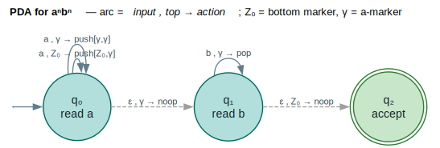
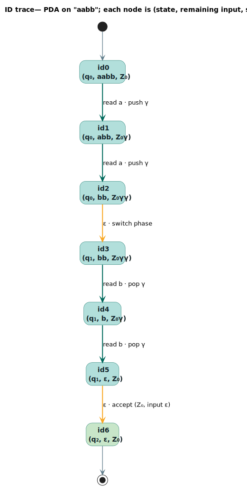

# Weighted Pushdown Automata

A **weighted pushdown automaton (PDA)** is a finite automaton augmented with an
unbounded **stack**: on each transition it consumes an input symbol (or $`\varepsilon`$),
inspects the symbol on top of the stack, and rewrites the stack top. The stack is
what lets a PDA count and nest — recognizing context-free languages such as
balanced brackets or $`a^n b^n`$ that no finite-state machine can. This module
([`src/pushdown/`](../../src/pushdown/)) attaches semiring weights to that model,
so each accepting computation carries a $`\otimes`$-weight and a language gets a
$`\oplus`$-aggregated score.

---

## Terms & symbols

Shared notation lives in [`NOTATION.md`](../NOTATION.md); the acronyms **PDA**
(Pushdown Automaton), **CFL** (Context-Free Language), and **ID** (Instantaneous
Description) are expanded there. Locally:

| Symbol / term | Meaning |
|---|---|
| $`Q`$ | Finite set of states. |
| $`\Sigma`$ | Input alphabet (the Rust label type `L`). |
| $`\Gamma`$ | Stack alphabet (`StackSymbol`, a wrapped `u32`). |
| $`q_0`$ | Start state. |
| $`Z_0`$ | The initial / bottom-of-stack marker, `StackSymbol::BOTTOM` (= $`\gamma_0`$). |
| $`F \subseteq Q`$ | Final states. |
| $`\Delta`$ | Transition relation (weighted; see below). |
| $`\rho`$ | Final-weight function $`\rho : F \to K`$. |
| $`K`$ | Carrier of the weight semiring `W`. |
| $`\otimes`$, $`\oplus`$ | Semiring *times* (sequential) and *plus* (alternative). |
| $`\bar{0}`$, $`\bar{1}`$ | The $`\oplus`$- and $`\otimes`$-identities. |
| $`\gamma`$ | A stack symbol in $`\Gamma`$ (drawn $`\gamma_1`$, $`\gamma_2`$, …; $`Z_0 = \gamma_0`$). |
| $`(q, w, \gamma)`$ | An **instantaneous description** (ID): current state, remaining input, stack. |
| $`\vdash`$ | The "yields in one step" relation between IDs. |

---

## Formal model

A weighted pushdown automaton is the tuple

```math
P = (Q, \Sigma, \Gamma, q_0, Z_0, F, \Delta, \rho)
```

with components:

| Component | Type | Role |
|---|---|---|
| $`Q`$ | finite set | States. |
| $`\Sigma`$ | alphabet | Input symbols. |
| $`\Gamma`$ | alphabet | Stack symbols, with distinguished bottom $`Z_0 \in \Gamma`$. |
| $`q_0 \in Q`$ | state | Start state. |
| $`Z_0 \in \Gamma`$ | symbol | The symbol initially on the stack. |
| $`F \subseteq Q`$ | state subset | Final states. |
| $`\Delta`$ | relation | Transitions $`(q, a, X) \to (q', \sigma, w)`$: from $`q`$, optionally reading $`a \in \Sigma \cup \{\varepsilon\}`$, with $`X \in \Gamma`$ on top, go to $`q'`$, apply stack action $`\sigma`$, weight $`w \in K`$. |
| $`\rho`$ | $`F \to K`$ | Final weight of an accepting state. |

A **stack action** $`\sigma`$ (`StackAction`) is one of four operations applied to the
top of the stack $`X`$:

| Action | Effect on the stack (top at right) | Net height change |
|---|---|---|
| $`\operatorname{Pop}`$ | remove $`X`$ | $`-1`$ |
| $`\operatorname{Push}(\gamma_1\dots\gamma_m)`$ | remove $`X`$, then push $`\gamma_1\dots\gamma_m`$ (so $`\gamma_m`$ ends on top) | $`m - 1`$ |
| $`\operatorname{Replace}(\gamma_1\dots\gamma_m)`$ | remove $`X`$, then push $`\gamma_1\dots\gamma_m`$ (an explicit pop-then-push) | $`m - 1`$ |
| $`\operatorname{Noop}`$ | leave $`X`$ in place | $`0`$ |

> **Why `Push` and `Replace` both pop first.** In this library a transition is
> *guarded* by the required top symbol $`X`$, and applying the action always
> consumes that matched $`X`$ before pushing the new sequence — so
> $`\operatorname{Push}([Z_0, \gamma])`$ on top $`Z_0`$ yields stack $`\dots Z_0\gamma`$. `Replace` is the same
> operation, named to document intent; only `Noop` leaves the matched symbol in
> place. (See [`StackAction::apply`](../../src/pushdown/stack.rs).)

### Instantaneous descriptions

A configuration, or **instantaneous description (ID)**, is the triple

```math
(q, w, \gamma)
```

— state $`q \in Q`$, remaining input $`w \in \Sigma^*`$, and stack contents $`\gamma \in \Gamma^*`$ (the
top at the right end). One transition step is the relation $`\vdash`$:

```math
\begin{aligned}
(q, a \cdot w, \beta \cdot X) &\vdash (q', w, \beta \cdot \sigma(X)) && \text{when } (q, a, X) \to (q', \sigma, w') \in \Delta \\
(q, w, \beta \cdot X) &\vdash (q', w, \beta \cdot \sigma(X)) && \text{when } (q, \varepsilon, X) \to (q', \sigma, w') \in \Delta \quad (\varepsilon\text{-move, input unchanged})
\end{aligned}
```

The start ID is $`(q_0, w, Z_0)`$ for input $`w`$. The weight of a run is the
$`\otimes`$-product of the weights of the $`\Delta`$-steps it uses (closed by $`\rho`$ when accepting
in a final state).

### Acceptance modes

The library supports the three classical acceptance conditions, selected by
[`PdaAcceptMode`](../../src/pushdown/traits.rs); an ID is accepting only when the
input is fully consumed ($`w = \varepsilon`$):

| `PdaAcceptMode` | Accepts when input is exhausted **and** … | Accepting weight |
|---|---|---|
| `FinalState` (default) | the state is in $`F`$ | $`\rho(q)`$ |
| `EmptyStack` | the stack is empty | $`\bar{1}`$ |
| `Both` | state $`\in F`$ **or** stack empty | $`\rho(q)`$, else $`\bar{1}`$ |

It is a standard result that the three modes recognize exactly the
context-free languages and are inter-convertible
([Mohri 2009](../BIBLIOGRAPHY.md#ref-mohri2009)).

---

## Intuition: recognizing $`a^n b^n`$

The canonical non-regular language $`\{\, a^n b^n \mid n \ge 1 \,\}`$ needs memory of *how
many* `a`s were seen — exactly what a stack provides. The
[`PdaBuilder::a_n_b_n`](../../src/pushdown/builder.rs) construction uses three
states and one auxiliary stack symbol $`\gamma`$ (`StackSymbol::new(1)`):

1. In $`q_0`$ ("read `a`"), each `a` **pushes** a marker $`\gamma`$ (the first on $`Z_0`$, the
   rest on $`\gamma`$). The stack height records $`n`$.
2. An $`\varepsilon`$-move on a $`\gamma`$ top switches to $`q_1`$ ("read `b`").
3. In $`q_1`$, each `b` **pops** one $`\gamma`$ — matching one `b` per `a`.
4. An $`\varepsilon`$-move on $`Z_0`$ (all markers gone) accepts in the final state $`q_2`$.

So `aabb` drives the stack $`Z_0 \to Z_0\gamma \to Z_0\gamma\gamma \to Z_0\gamma\gamma \to Z_0\gamma \to Z_0`$, ending on $`Z_0`$
with the input exhausted — accept. The string `aab` would leave a $`\gamma`$ unmatched,
and `abb` would try to pop from $`Z_0`$ — both rejected. This machine is drawn in the
[Diagrams](#diagrams) section, with its full ID trace.

---

## Architecture & API

| Item | Kind | Responsibility |
|---|---|---|
| [`WeightedPda<L, W>`](../../src/pushdown/traits.rs) | trait | Structural queries + acceptance predicates (`start`, `initial_stack`, `accept_mode`, `transitions`, `is_accepting`, `accepting_weight`). |
| [`VectorPda<L, W>`](../../src/pushdown/vector.rs) | struct | Default implementation; also hosts the executable `accepts` / `total_weight` / `approximate_fst`. |
| [`PdaState<L, W>`](../../src/pushdown/vector.rs) | struct | One state: `is_final`, `final_weight`, outgoing `transitions`. |
| [`PdaBuilder<L, W>`](../../src/pushdown/builder.rs) | struct | Construction with stack-symbol allocation and `add_push/pop/replace/read` helpers; canned `balanced_brackets`, `a_n_b_n`, `palindrome_with_center`. |
| [`StackSymbol`](../../src/pushdown/stack.rs) | struct | A `u32` stack symbol; `BOTTOM` is $`Z_0`$. |
| [`StackAction`](../../src/pushdown/stack.rs) | enum | `Pop` / `Push` / `Replace` / `Noop`, with `apply(&mut Vec<StackSymbol>)`. |
| [`PdaTransition<L, W>`](../../src/pushdown/transition.rs) | struct | An arc `{ from, input, stack_top, stack_action, to, weight }`. |
| [`PdaConfiguration<L>`](../../src/pushdown/traits.rs) | struct | An ID `{ state, remaining_input, stack }` with `apply_transition`. |
| [`PdaAcceptMode`](../../src/pushdown/traits.rs) | enum | `FinalState` / `EmptyStack` / `Both`. |

The `PdaConfiguration` *is* the ID $`(q, w, \gamma)`$: `state` is $`q`$, `remaining_input`
is $`w`$, and `stack` is $`\gamma`$ with the top at the end. Its `apply_transition`
realizes a single $`\vdash`$ step — it checks the stack top, optionally consumes input,
and applies the stack action:

```rust
// from src/pushdown/traits.rs — one ⊢ step
use lling_llang::pushdown::{PdaConfiguration, PdaTransition, StackSymbol, StackAction};
use lling_llang::semiring::{Semiring, TropicalWeight};

let config: PdaConfiguration<char> =
    PdaConfiguration::new(0, vec!['a', 'b'], vec![StackSymbol::BOTTOM]);
let trans = PdaTransition::<char, TropicalWeight>::new(
    0, Some('a'), StackSymbol::BOTTOM,
    StackAction::Push(vec![StackSymbol::BOTTOM, StackSymbol::new(1)]),
    1, TropicalWeight::one(),
);
let next = config.apply_transition(&trans).expect("a on Z₀ is enabled");
assert_eq!(next.state, 1);
assert_eq!(next.remaining_input, vec!['b']);                 // 'a' consumed
assert_eq!(next.stack, vec![StackSymbol::BOTTOM, StackSymbol::new(1)]);  // pushed γ1
```

---

## Algorithms

### Recognition by configuration stepping

`VectorPda::accepts` decides membership by exploring the space of reachable IDs
breadth-first. The invariant is that the BFS queue holds exactly the IDs reachable
from the start ID $`(q_0, w, Z_0)`$ that have not yet been expanded, and the
`visited` set keys on $`(\text{state}, \lvert \text{remaining input}\rvert, \text{stack})`$ so that no ID is
expanded twice — which terminates the search on $`\varepsilon`$-cycles that revisit a
configuration.

```text
⟨ PDA accepts w ⟩ ≡
  queue   ← [ (q₀, w, [Z₀]) ]                         ⟨ start ID ⟩
  visited ← ∅
  while queue not empty:
      C ← queue.pop_front()
      key ← (C.state, ∣C.remaining∣, C.stack)
      if key ∈ visited: continue
      visited ← visited ∪ {key}
      if accepting(C): return true                    ⟨ input exhausted, mode satisfied ⟩
      X ← top(C.stack); if none: continue
      for e in ε-arcs(C.state, X):                    ⟨ ε-moves first ⟩
          if C′ ← e.apply(C): queue.push_back(C′)
      if a ← C.next_input():                          ⟨ then consume one symbol ⟩
          for e in arcs(C.state, a, X) with e non-ε:
              if C′ ← e.apply(C): queue.push_back(C′)
  return false
```

The chunk `` ⟨ input exhausted, mode satisfied ⟩ `` calls `is_config_accepting`,
which applies the [acceptance mode](#acceptance-modes) table. The two arc loops
correspond to the $`\varepsilon`$-transition and input-consuming branches of $`\vdash`$.

**Complexity.** The state space is the set of distinct IDs. The `visited` key
bounds revisits, but the *stack* component can grow without bound (a PDA's stack
is unbounded by definition), so in the worst case the number of reachable IDs —
and hence the running time — is not polynomial in $`\lvert w\rvert`$; for grammars whose stack
stays shallow it is effectively linear. The companion `total_weight` runs the
same search but accumulates the $`\oplus`$-sum of $`\otimes`$-path-weights over **all** accepting
runs rather than stopping at the first.

### Weighted aggregation and FST approximation

- `total_weight(w)` returns $`\bigoplus \{\, w(\pi) \mid \pi \text{ accepts } w \,\}`$ (the language weight
  of $`w`$), or `None` if $`w \notin L(P)`$.
- `approximate_fst(max_depth)` unrolls the stack up to `max_depth` symbols,
  producing an ordinary [`VectorWfst`](../architecture/wfst-traits.md) whose
  states are `(PDA state, stack contents)` pairs. This is a *regular
  approximation*: it captures exactly the runs whose stack never exceeds
  `max_depth`, after which standard finite-state algorithms apply.

---

## Examples

### Balanced parentheses

The `balanced_brackets` constructor recognizes $`\{\, (^n\, )^n \mid n \ge 0 \,\}`$ and its
nestings:

```rust
use lling_llang::pushdown::PdaBuilder;
use lling_llang::semiring::{Semiring, TropicalWeight};

let pda = PdaBuilder::balanced_brackets('(', ')', TropicalWeight::one());

assert!(pda.accepts("".chars()));
assert!(pda.accepts("()".chars()));
assert!(pda.accepts("(())".chars()));
assert!(pda.accepts("((()))".chars()));
assert!(!pda.accepts("(".chars()));
assert!(!pda.accepts("(()".chars()));
```

### $`a^n b^n`$ from primitives

The same language, built arc-by-arc to show the `push`/`pop`/$`\varepsilon`$ structure
mirrored in the [diagram](#diagrams):

```rust
use lling_llang::pushdown::{VectorPda, StackSymbol, StackAction, WeightedPda};
use lling_llang::semiring::{Semiring, TropicalWeight};

let mut pda: VectorPda<char, TropicalWeight> = VectorPda::new();
let s0 = pda.add_state();                                 // read a's
let s1 = pda.add_state();                                 // read b's
let s2 = pda.add_final_state(TropicalWeight::one());      // accept
pda.set_start(s0);

let z0 = StackSymbol::BOTTOM;
let g = StackSymbol::new(1);

pda.add_transition_parts(s0, Some('a'), z0, StackAction::Push(vec![z0, g]), s0, TropicalWeight::one());
pda.add_transition_parts(s0, Some('a'), g,  StackAction::Push(vec![g, g]),  s0, TropicalWeight::one());
pda.add_epsilon_transition(s0, g, StackAction::Noop, s1, TropicalWeight::one());
pda.add_transition_parts(s1, Some('b'), g,  StackAction::Pop, s1, TropicalWeight::one());
pda.add_epsilon_transition(s1, z0, StackAction::Noop, s2, TropicalWeight::one());

assert!(pda.accepts("aabb".chars()));
assert!(pda.accepts("aaabbb".chars()));
assert!(!pda.accepts("aab".chars()));
assert!(!pda.accepts("abb".chars()));
```

### Accepting by empty stack

```rust
use lling_llang::pushdown::{VectorPda, PdaAcceptMode, StackSymbol, StackAction};
use lling_llang::semiring::{Semiring, TropicalWeight};

let mut pda: VectorPda<char, TropicalWeight> =
    VectorPda::with_accept_mode(PdaAcceptMode::EmptyStack);
let s0 = pda.add_state();
pda.set_start(s0);
// Reading 'a' pops Z₀, emptying the stack.
pda.add_transition_parts(s0, Some('a'), StackSymbol::BOTTOM, StackAction::Pop, s0, TropicalWeight::one());

assert!(pda.accepts("a".chars()));    // stack emptied
assert!(!pda.accepts("".chars()));    // stack still holds Z₀
```

---

## Diagrams

### PDA for $`a^n b^n`$ with stack actions



*Teal nodes = PDA states; each arc reads $`\text{input}, \text{stack top} \to \text{action}`$; the green
double-ring $`q_2`$ is final; grey dashed arcs are $`\varepsilon`$-moves (phase switch and
accept). $`Z_0`$ is the bottom marker, $`\gamma`$ the per-`a` marker.*

<details><summary>Text view</summary>

```text
                 a , Z₀ → push[Z₀,γ]            b , γ → pop
                 a , γ  → push[γ,γ]                 ┌──┐
                    ┌──┐                            │  │
                    │  ▼                            ▼  │
   start ─▶ (q₀ read a) ─ ─ ε , γ → noop ─ ─▶ (q₁ read b) ─ ─ ε , Z₀ → noop ─ ─▶ ((q₂ accept))

   stack on "aabb":  Z₀ → Z₀γ → Z₀γγ → Z₀γγ → Z₀γ → Z₀   (then ε-accept)
```

</details>

### ID trace on `aabb`



*Each node is an ID `(state, remaining input, stack)`; teal arcs are
input-consuming steps, amber arcs are $`\varepsilon`$-moves, and the green node is the
accepting ID (input $`\varepsilon`$, stack $`Z_0`$, state $`q_2`$).*

<details><summary>Text view</summary>

```text
(q₀, aabb, Z₀)
   │  read a · push γ
(q₀, abb,  Z₀γ)
   │  read a · push γ
(q₀, bb,   Z₀γγ)
   ┊  ε · switch phase
(q₁, bb,   Z₀γγ)
   │  read b · pop γ
(q₁, b,    Z₀γ)
   │  read b · pop γ
(q₁, ε,    Z₀)
   ┊  ε · accept  (top Z₀, input ε)
(q₂, ε,    Z₀)        ← accepting
```

</details>

---

## Relation to the library

- **Beyond finite-state composition.** PDAs recognize the context-free languages,
  a strict superset of the regular languages handled by the
  [WFST](../architecture/wfst-traits.md) core; they complement the
  lattice-oriented [CFG/Earley parser](../algorithms/parsing.md) when an explicit
  stack machine is the more natural formulation.
- **`approximate_fst` bridges back to WFSTs.** Bounding the stack depth yields a
  `VectorWfst`, after which [composition](../algorithms/composition.md),
  [determinization](../algorithms/determinization.md), and
  [path extraction](../algorithms/path-extraction.md) all apply.
- **Weights are any semiring.** `total_weight` aggregates with $`\oplus`$/$`\otimes`$ over the
  chosen [semiring](../architecture/semirings.md); the examples use
  `TropicalWeight`, but Log or Probability give expected counts / probabilities.
- **No feature flag.** Always compiled (`pub mod pushdown;` in
  [`src/lib.rs`](../../src/lib.rs)) and re-exported from the crate `prelude`.

See the [transducer-family overview](README.md) to place pushdown automata among
the multi-tape, tree, subsequential, and neural transducer families.

---

## References

- <a id="cite-mohri2009"></a>[Mohri 2009](../BIBLIOGRAPHY.md#ref-mohri2009) —
  Mohri, M. (2009). *Weighted Automata Algorithms.* In *Handbook of Weighted
  Automata*, pp. 213–254. Springer. Weighted pushdown systems and the
  equivalence of final-state and empty-stack acceptance.
- <a id="cite-mohri1997"></a>[Mohri 1997](../BIBLIOGRAPHY.md#ref-mohri1997) —
  Mohri, M. (1997). *Finite-State Transducers in Language and Speech Processing.*
  Computational Linguistics 23(2):269–311. Background on weighted automata and the
  semiring framework the weights inhabit.
- <a id="cite-allauzen2007"></a>[Allauzen 2007](../BIBLIOGRAPHY.md#ref-allauzen2007) —
  Allauzen, C., Riley, M., Schalkwyk, J., Skut, W., & Mohri, M. (2007).
  *OpenFst: A General and Efficient Weighted Finite-State Transducer Library.*
  CIAA 2007. The finite-state library this module's `approximate_fst` output
  targets.
