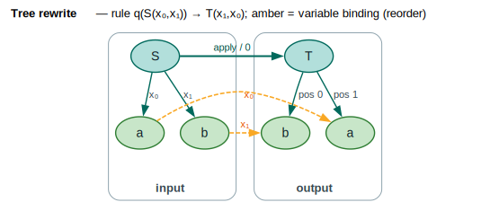

# Weighted Tree Transducers

A **weighted tree transducer (WTT)** rewrites *trees* into *trees*, the way a
string transducer rewrites strings into strings. Each rule matches a state at a
node, reads that node's symbol and its child subtrees as variables, and emits an
output tree that may **reorder, copy, delete, or relabel** those variables — all
carried with a semiring weight. This is the natural machine for syntax-directed
translation, parse-tree normalization, and AST-to-AST program transformation. The
implementation is in [`src/tree_transducers/`](../../src/tree_transducers/), and
the model follows
[Fülöp & Vogler 2009](../BIBLIOGRAPHY.md#ref-fulop2009).

---

## Terms & symbols

Shared notation is in [`NOTATION.md`](../NOTATION.md); **WTT** abbreviates
*Weighted Tree Transducer*. Locally:

| Symbol / term | Meaning |
|---|---|
| `Q` | Finite set of states. |
| `Σ` | Input **ranked alphabet** — symbols each with a fixed arity. |
| `Δ` | Output ranked alphabet. |
| `q₀` | Initial state (`start()`). |
| `F ⊆ Q` | Final states. |
| `R` | Set of weighted rules. |
| `ρ` | Final-weight function `ρ : F → K`. |
| `K` | Carrier of the weight semiring `W`. |
| `⊗`, `⊕` | Semiring *times* (along a derivation) and *plus* (over derivations). |
| `0̄`, `1̄` | The `⊕`- and `⊗`-identities. |
| `σ`, `δ` | An input symbol (`σ ∈ Σ`) and an output symbol (`δ ∈ Δ`). |
| `xᵢ` | A variable bound to the `i`-th child subtree of the matched node. |
| `arity(σ)` | Number of children `σ` takes (its rank). |
| `π` | A permutation/selection of variable indices in a rule's right-hand side. |

---

## Formal model

A weighted tree transducer is the tuple

`` `T = (Q, Σ, Δ, q₀, F, R, ρ)` ``

| Component | Type | Role |
|---|---|---|
| `Q` | finite set | States. |
| `Σ` | ranked alphabet | Input symbols with arities. |
| `Δ` | ranked alphabet | Output symbols with arities. |
| `q₀ ∈ Q` | state | Initial state. |
| `F ⊆ Q` | state subset | Final states. |
| `R` | rule set | Weighted rewrite rules (below). |
| `ρ` | `F → K` | Final weight of an accepting state. |

A **rule** in `R` has the shape

`` `q(σ(x₁,…,xₙ)) → δ(q₁(x_π₍₁₎),…,qₘ(x_π₍ₘ₎)), w` ``

read as: *in state `q`, at a node labeled `σ` with `n = arity(σ)` children bound
to `x₁…xₙ`, produce an output node labeled `δ`; recurse into the selected input
children `x_π₍ⱼ₎` in states `qⱼ`; charge weight `w ∈ K`.* The right-hand side is a
**tree pattern** whose leaves are either *variables* `qⱼ(x_π₍ⱼ₎)` (process input
child `π(j)` in state `qⱼ`) or *fixed subtrees* (constant output material).

The class of a rule is determined by how it uses the input variables — a
distinction the library exposes directly:

| Property | Condition | `TreeRule` predicate |
|---|---|---|
| **linear** | every input variable used exactly once | `is_linear()` |
| **deleting** | some input variable not used at all | `is_deleting()` |
| **copying** | some input variable used more than once | `is_copying()` |
| **identity-like** | `σ = δ`, same arity, variables in order `x₀,x₁,…` | `is_identity_like()` |

The weight a transducer assigns to an input/output tree pair `(t, t′)` is the
`⊕`-sum, over all derivations `d` that rewrite `t` into `t′`, of the `⊗`-product
of the rule weights used in `d`:

```text
T(t, t′) = ⊕ { ⊗ over rules r used in d of weight(r)  ∣  d : q₀(t) ⇒* t′ }.
```

> **Ranked alphabet.** A [`RankedAlphabet`](../../src/tree_transducers/alphabet.rs)
> assigns each symbol an `arity` (number of children); a `Symbol::binary("S")`
> has arity 2, `Symbol::constant("a")` arity 0. The `SimpleAlphabet` map stores
> arities for symbols whose rank is not intrinsic to the label type (e.g. plain
> `String`s default to arity 0 unless registered).

---

## Intuition: swapping two children

The smallest interesting rule is a **swap**: relabel `S` to `T` and exchange its
two children. As a rule,

`` `q(S(x₀, x₁)) → T(x₁, x₀), 0̄?` `` — no: weight `1̄` (cost 0 in Tropical),

so the variable selection is the permutation `π = (1, 0)`. Applied to the input
tree `S(a, b)` it yields `T(b, a)`:

```text
        S                    T
       ╱ ╲       ──▶        ╱ ╲
      a   b                b   a
     x₀   x₁          (x₁ here) (x₀ here)
```

Child `b` (bound to `x₁`) lands in output position 0, and `a` (bound to `x₀`)
lands in position 1. The leaves are themselves rewritten by trivial identity
rules `q(a) → a` and `q(b) → b`. This is the rewrite drawn in the
[Diagrams](#diagrams) section.

---

## Architecture & API

| Item | Kind | Responsibility |
|---|---|---|
| [`WeightedTreeTransducer<L, W>`](../../src/tree_transducers/transducer.rs) | trait | Structural queries: `start`, `is_final`, `final_weight`, `rules(state, symbol)`, `all_rules`. |
| [`TreeTransducerOps<L, W>`](../../src/tree_transducers/transducer.rs) | trait (blanket) | Execution: `transduce`, `transduce_from_state`, `apply_rule`. |
| [`VectorTreeTransducer<L, W>`](../../src/tree_transducers/transducer.rs) | struct | Default implementation; rules indexed by `(state, symbol)`. |
| [`TransducerState<W>`](../../src/tree_transducers/transducer.rs) | struct | One state: `is_final`, `final_weight`. |
| [`TreeTransducerBuilder<L, W>`](../../src/tree_transducers/builder.rs) | struct | Construction with `add_identity_rule` / `add_relabel_rule` / `add_swap_rule` / `add_copy_rule` / `add_deletion_rule`. |
| [`RankedAlphabet`](../../src/tree_transducers/alphabet.rs) | trait | `arity()` / `is_constant()` for a symbol. |
| [`Symbol<L>`](../../src/tree_transducers/alphabet.rs), [`SimpleAlphabet<L>`](../../src/tree_transducers/alphabet.rs) | struct | A symbol with explicit arity; a label→arity map. |
| [`Tree<L>`](../../src/tree_transducers/tree.rs) / [`TreeNode<L>`](../../src/tree_transducers/tree.rs) | struct | A tree (`label` + `children`); `depth`, `size`, `subtree`, `replace`, `preorder`. |
| [`TreeRule<L, W>`](../../src/tree_transducers/rule.rs) | struct | One rule `{ state, input_symbol, input_arity, output_pattern, weight }`. |
| [`TreePattern<L>`](../../src/tree_transducers/rule.rs) | struct | A right-hand-side tree (`symbol` + `children`). |
| [`TreeChild<L>`](../../src/tree_transducers/rule.rs) | enum | `Variable { state, var_index }` or `Subtree(Box<TreePattern>)`. |

As with the other families, `TreeTransducerOps` is a **blanket** extension over
`WeightedTreeTransducer`, so a concrete transducer implements only the query
trait. A rule's right-hand side is a `TreePattern` whose `TreeChild`s are either
variables (carrying which input child to recurse into, in which state) or fixed
subtrees:

```rust
use lling_llang::tree_transducers::{TreePattern, TreeChild, TreeRule};
use lling_llang::semiring::{Semiring, TropicalWeight};

// q(S(x₀, x₁)) → T(x₁, x₀)  — a swap, encoded as the pattern T(var 1, var 0).
let rhs = TreePattern::new("T", vec![TreeChild::variable(0, 1), TreeChild::variable(0, 0)]);
let rule: TreeRule<&str, TropicalWeight> = TreeRule::new(0, "S", 2, rhs, TropicalWeight::one());

assert!(rule.is_linear());          // each of x₀, x₁ used exactly once
assert!(!rule.is_identity_like());  // S ≠ T and the order is reversed
```

The trait/value-type relationships are summarized in the
[2-tape trait diagram](multitape.md#trait-hierarchy) for the sibling multi-tape
module; the tree family mirrors that shape (query trait + blanket ops + vector
backing + builder), with `TreeRule`/`TreePattern`/`TreeChild` as the value types.

---

## Algorithms

### Top-down transduction

`TreeTransducerOps::transduce` rewrites an input tree by recursive descent: at a
node it tries every rule registered for `(current state, node symbol)` whose
arity matches, rewriting each variable child by recursing into the corresponding
input subtree, and combining the per-child results by **cartesian product** (a
node has one output per choice of outputs at each child). The invariant is that
`transduce_from_state(q, t)` returns the set of `(output tree, weight)` pairs `T`
can produce from `t` starting in state `q`.

```text
⟨ transduce tree t in state q ⟩ ≡
  results ← ∅
  for each rule r with r.state = q and r.input_symbol = label(t):
      if r.input_arity ≠ arity(t): continue            ⟨ arity guard ⟩
      results ← results ∪ apply_rule(r, t)
  if q ∈ F and t is a leaf and results = ∅:            ⟨ accept a leaf verbatim ⟩
      results ← { (t, ρ(q)) }
  return results

⟨ apply_rule r to t ⟩ ≡
  for each child c of r.output_pattern:
      case c of
        Variable{state qⱼ, var_index i}:               ⟨ recurse into input child i ⟩
            if i ≥ arity(t): fail
            child_outputs[c] ← transduce_from_state(qⱼ, t.children[i])
        Subtree(p):                                     ⟨ constant output material ⟩
            child_outputs[c] ← { (instantiate(p), 1̄) }
  for each (children, w_children) in cartesian_product(child_outputs):
      emit ( node(r.output_pattern.symbol, children),  r.weight ⊗ w_children )
```

The chunk `` ⟨ recurse into input child i ⟩ `` is where variable **reordering**
happens: `var_index` may point to any input child, in any order, so the swap rule
above selects child 1 then child 0. **Copying** falls out for free — two
`Variable` children with the same `var_index` recurse into the same input subtree
twice — and **deletion** is a right-hand side that simply omits a variable (a leaf
output pattern). The cartesian product threads weights with `⊗`, so ambiguous
inputs yield multiple weighted outputs.

**Complexity.** For a linear, unambiguous transducer the work is
`` `O(∣t∣)` `` in the input tree size (one rule application per node). Copying
rules can duplicate subtrees, and ambiguity (several rules per `(state, symbol)`)
multiplies the output set via the cartesian product, so the output count — and
the time — can grow with the number of derivations.

---

## Examples

### Build and run a swap transducer

```rust
use lling_llang::tree_transducers::{TreeTransducerBuilder, Tree, TreeTransducerOps};
use lling_llang::semiring::{Semiring, TropicalWeight};

let mut builder: TreeTransducerBuilder<&str, TropicalWeight> = TreeTransducerBuilder::new();
let s0 = builder.add_state();
builder.set_start(s0);
builder.set_final(s0, TropicalWeight::one());

// S(x0, x1) → T(x1, x0); leaves map to themselves.
builder.add_swap_rule(s0, "S", "T", &[1, 0], TropicalWeight::one());
builder.add_identity_rule(s0, "a", 0, TropicalWeight::one());
builder.add_identity_rule(s0, "b", 0, TropicalWeight::one());
let tt = builder.build();

let input = Tree::node("S", vec![Tree::leaf("a"), Tree::leaf("b")]);
let outputs = tt.transduce(&input);

assert_eq!(outputs.len(), 1);
assert_eq!(outputs[0].0.label(), &"T");
assert_eq!(outputs[0].0.children()[0].label(), &"b");   // swapped
assert_eq!(outputs[0].0.children()[1].label(), &"a");
```

### Copying and deleting

```rust
use lling_llang::tree_transducers::{TreeTransducerBuilder, Tree, TreeTransducerOps};
use lling_llang::semiring::{Semiring, TropicalWeight};

// Copy: S(x0) → T(x0, x0).
let mut copy: TreeTransducerBuilder<&str, TropicalWeight> = TreeTransducerBuilder::new();
let c0 = copy.add_state();
copy.set_start(c0);
copy.set_final(c0, TropicalWeight::one());
copy.add_copy_rule(c0, "S", 1, "T", &[0, 0], TropicalWeight::one());
copy.add_identity_rule(c0, "a", 0, TropicalWeight::one());
let copy = copy.build();

let out = copy.transduce(&Tree::node("S", vec![Tree::leaf("a")]));
assert_eq!(out[0].0.arity(), 2);                       // x0 duplicated
assert_eq!(out[0].0.children()[0].label(), &"a");
assert_eq!(out[0].0.children()[1].label(), &"a");

// Delete: S(x0, x1) → DELETED (a leaf), dropping both children.
let mut del: TreeTransducerBuilder<&str, TropicalWeight> = TreeTransducerBuilder::new();
let d0 = del.add_state();
del.set_start(d0);
del.set_final(d0, TropicalWeight::one());
del.add_deletion_rule(d0, "S", 2, "DELETED", TropicalWeight::one());
let del = del.build();

let out = del.transduce(&Tree::node("S", vec![Tree::leaf("a"), Tree::leaf("b")]));
assert!(out[0].0.is_leaf());
assert_eq!(out[0].0.label(), &"DELETED");
```

### Weighted ambiguity

Two rules for the same input produce two weighted outputs — the `⊕`-alternatives:

```rust
use lling_llang::tree_transducers::{TreeTransducerBuilder, Tree, TreeTransducerOps};
use lling_llang::semiring::{Semiring, TropicalWeight};

let mut builder: TreeTransducerBuilder<&str, TropicalWeight> = TreeTransducerBuilder::new();
let s0 = builder.add_state();
builder.set_start(s0);
builder.set_final(s0, TropicalWeight::one());
builder.add_relabel_rule(s0, "S", "T1", 0, TropicalWeight::new(1.0));
builder.add_relabel_rule(s0, "S", "T2", 0, TropicalWeight::new(2.0));
let tt = builder.build();

let outputs = tt.transduce(&Tree::leaf("S"));
assert_eq!(outputs.len(), 2);
let weights: Vec<_> = outputs.iter().map(|(_, w)| w.value()).collect();
assert!(weights.contains(&1.0) && weights.contains(&2.0));
```

---

## Diagrams

### Tree rewrite with variable reordering



*Teal = tree nodes/edges (green leaves are terminals); the bold teal root edge is
the rule application `q(S…) → T…` with its weight; the dashed amber edges are the
variable bindings — `x₁` carries child `b` to output position 0 and `x₀` carries
`a` to position 1 (the reordering).*

<details><summary>Text view</summary>

```text
        input                         output
          S                              T
        ╱   ╲    apply / 0  ═══▶       ╱   ╲
   x₀  a     b  x₁                    b     a
       │      └───────  x₁  ─ ─ ─ ─▶  position 0
       └──────────────  x₀  ─ ─ ─ ─▶  position 1

  rule:  q( S(x₀, x₁) )  →  T( x₁, x₀ ),  w = 0   (Tropical 1̄)
```

</details>

---

## Relation to the library

- **Hierarchical analogue of string transducers.** A tree transducer is to the
  [WFST](../architecture/wfst-traits.md) what a tree is to a string; the
  linear/deleting/copying taxonomy refines the classes describable by finite-state
  transducers.
- **Syntax-directed translation.** Reordering + relabeling rules express
  syntax-based machine translation and parse-tree normalization; deletion and
  flattening rules linearize or prune structure.
- **Weights are any semiring.** Ambiguous derivations are combined with
  `⊕`/`⊗` over the chosen [semiring](../architecture/semirings.md); the examples
  use `TropicalWeight`.
- **No feature flag.** Always compiled (`pub mod tree_transducers;` in
  [`src/lib.rs`](../../src/lib.rs)) and re-exported from the crate `prelude`
  (with `Symbol` re-exported as `RankedSymbol` to avoid colliding with the
  [CFG](../algorithms/parsing.md) `Symbol`).

See the [transducer-family overview](README.md) to compare tree transducers with
the multi-tape, pushdown, subsequential, and neural transducer families.

---

## References

- <a id="cite-fulop2009"></a>[Fülöp & Vogler 2009](../BIBLIOGRAPHY.md#ref-fulop2009) —
  Fülöp, Z., & Vogler, H. (2009). *Weighted Tree Automata and Tree Transducers.*
  In *Handbook of Weighted Automata*, pp. 313–403. Springer. The reference model
  for weighted tree transducers, their rule classes (linear/deleting/copying), and
  semiring-weighted derivations.
- <a id="cite-mohri2009"></a>[Mohri 2009](../BIBLIOGRAPHY.md#ref-mohri2009) —
  Mohri, M. (2009). *Weighted Automata Algorithms.* In *Handbook of Weighted
  Automata*, pp. 213–254. Springer. The string-level weighted-automata algorithms
  this hierarchical model parallels.
