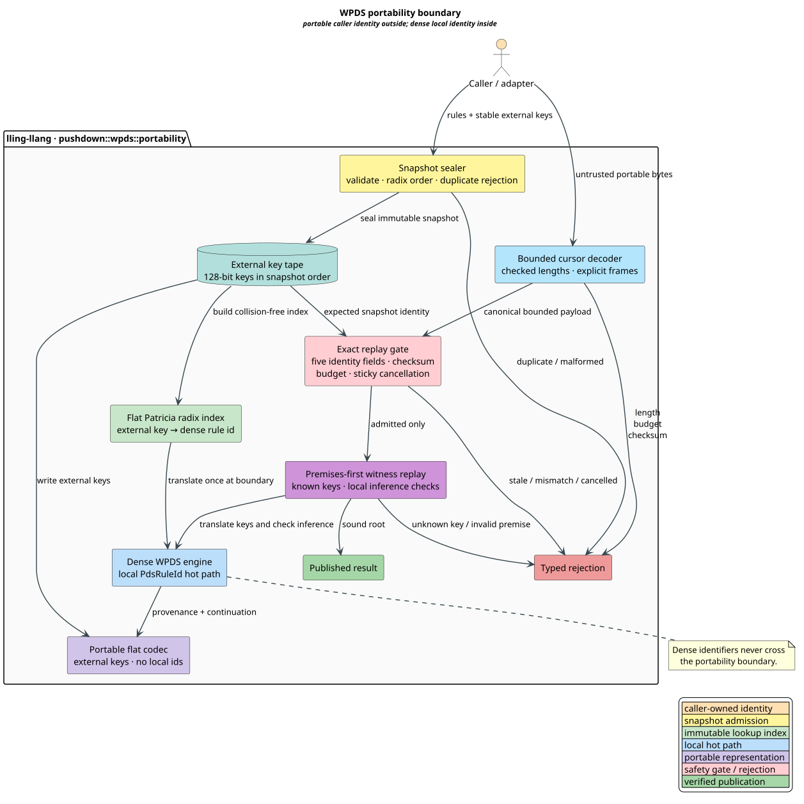
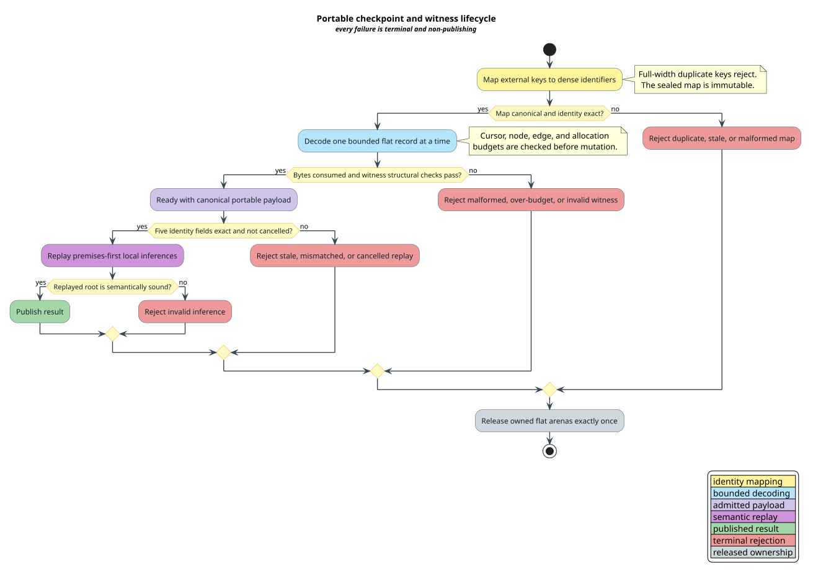

# Portable WPDS Checkpoints and Witnesses

This document specifies the portability boundary for lling-llang weighted
pushdown systems (WPDSs). It separates caller-owned stable rule identity from
dense process-local identifiers while preserving the existing stack-safe
saturation, checkpoint, and witness machines.

The contract was developed formal-first. The production rule-map and witness
codec are admitted only because the Rocq, TLA+/TLC, Z3, Kani, mutation, and
formerly required-red Rust property gates pass without weakening.

## Terms

| Term | Definition |
|---|---|
| **WPDS** | Weighted pushdown system: a finite set of normalized stack-rewrite rules carrying weights. |
| **external rule key** | Caller-owned opaque 128-bit identity. Equality compares all 16 bytes; it is an identity, not a probabilistic hash assumption. |
| **dense rule identifier** | Zero-based process-local position used by the saturation hot path. It is meaningful only within one sealed snapshot. |
| **rule snapshot** | Immutable ordered rule tape, its external-key tape, normalized rule semantics, weight encoding, and snapshot digest. |
| **portable evidence** | Checkpoint, provenance, or witness data that names rules by external key rather than by a local dense identifier. |
| **replay identity** | Five-field identity tuple binding rules, context, query, semantics, and codec profile. |
| **premises-first** | Flat proof order in which every premise index is smaller than its conclusion index. |
| **publication** | Making a resumed result or validated witness available to a caller. Rejection never publishes. |

## Architectural boundary



[PlantUML source](../diagrams/transducers/wpds-portability-boundary.puml)

The portability module belongs beside the WPDS engine because it translates
the engine's rules, continuation state, and provenance. It does not belong in
libcpg, and it does not depend on a code property graph (CPG). A future crate
may adapt libcpg objects to these interfaces, but that adapter must depend on
lling-llang rather than introducing a reverse dependency.

The boundary has one governing rule: dense identifiers never enter a portable
encoding. A decoder resolves external keys against the expected immutable rule
snapshot before it hands local identifiers to the engine.

<details><summary>Text view</summary>

<!-- vdl-disable-next-line ASCII001 -->
```text
caller rules + external keys
             |
             v
snapshot seal -> key tape <-> flat radix index -> dense WPDS hot path
                    |                                |
                    +------ portable codec <---------+
                                  |
                                  v
bounded decoder -> exact identity gate -> witness replay -> publication
        |                  |                  |
        +------------------+------------------+-> typed rejection
```

</details>

## Identity and compatibility

Let the replay identity be the tuple
$`I = (R, C, Q, S, V)`$, where:

- $`R`$ is the complete rule-snapshot digest;
- $`C`$ is the caller-supplied context digest;
- $`Q`$ identifies the exact query and saturation direction;
- $`S`$ identifies weight semantics, convergence policy, and normalized rule
  interpretation; and
- $`V`$ identifies the wire codec and canonicalization profile.

Replay admission uses structural equality, not partial compatibility:

```math
\mathrm{admit}(I_e, I_o)
\iff
(I_e = I_o) \land K \land M \land B \land \neg X \land W,
```

where $`K`$ means the checksum is valid, $`M`$ means the payload is canonical
and well formed, $`B`$ means every budget is respected, $`X`$ means
cancellation was requested, and $`W`$ means the portable witness is valid.
Every conjunct is mandatory. A mismatch creates a typed rejection; it never
falls back to best-effort replay.

The snapshot digest covers the ordered external-key tape and the canonical
encodings of normalized rules and weights. Reordering rules therefore creates
a different snapshot even when the mathematical rule set is extensionally
equal. This keeps local dense identifiers simple and unambiguous. Portable
evidence remains reusable because it stores external keys and is rebound only
after exact snapshot admission.

## Rule-map construction

The production representation is an immutable bidirectional map:

- `external_for[dense]` is a flat key tape in snapshot order;
- `dense_for(external)` is a flat radix-ordered index whose entry stores the
  dense position; and
- duplicate 16-byte keys are rejected before the snapshot is sealed.

The builder radix-orders temporary `(external_key, dense_id)` pairs, detects
adjacent duplicates, and emits a flat radix-ordered lookup index. Dense
identifiers retain snapshot order; radix order exists only inside that index.
Consequently, construction examines a constant 16 key bytes per rule. Lookup
converts the 16-byte key once and performs $`O(\log n)`$ full-width word
comparisons. Every traversal is an explicit loop.

The following literate pseudocode is normative. The prose states the invariant
before the operation that preserves it.

```text
Algorithm SealRuleMap(keys)
  Precondition: keys contains one caller key for every normalized rule.
  Invariant: pairs[0..i) preserves each rule's original dense position.
  1. Form pairs (key, original_position) with checked allocation.
  2. Stable-radix-order pairs by all 16 key bytes.
  Invariant: equal keys are adjacent and no key bytes were discarded.
  3. Reject if any adjacent pair has equal full-width keys.
  4. Convert each full-width key once to a big-endian word and seal the flat
     radix-ordered lookup index.
  5. Seal external_for in original order and dense_for as immutable arenas.
  Postcondition: external_for and dense_for are mutual inverses.
```

Caller keys are opaque identities. If a caller derives them from a digest, the
caller owns collision resolution before sealing. lling-llang never treats two
equal 128-bit keys as distinct and never relies on a shortened fingerprint.

## Portable codec and decoder

The complete portability-envelope contract is flat, versioned,
length-prefixed, checksummed, and canonical. It binds the replay identity,
external-key tape, continuation records, provenance nodes, premise edges, and
weight/policy payloads. It contains no pointer, platform-sized integer,
recursive value, or process-local rule or proof identifier.

The current production tranche exposes two independently checksummed canonical
subrecords: `PortableRuleMap::encode_flat` writes the dense-order external-key
tape, and `PortableWitness::encode_flat` writes premises-first proof nodes and
edges. `PortableReplayIdentity::admits` supplies the mandatory five-field
publication gate. A complete checkpoint-envelope constructor remains a
follow-up surface; callers must not treat ad hoc concatenation of the two
subrecords as an admitted replay checkpoint.

The decoder is an explicit cursor machine. Before each mutation it checks:

- integer addition for overflow;
- input-byte bounds;
- node and premise-edge budgets;
- declared byte, node, and aggregate premise-edge budgets;
- canonical field order and unique map sections; and
- sticky cancellation.

Every successful byte-consuming step has positive width. If $`c_i`$ is the
cursor after step $`i`$ and $`N`$ is the admitted byte length, then
$`0 \le c_i \le N`$ and $`c_{i+1} > c_i`$. The remaining-byte measure
$`N - c_i`$ strictly decreases, so a finite payload cannot produce an infinite
positive-width decode trace.

## Witness portability and semantic replay

A portable proof node contains a fact, an optional external rule key, and a
flat list of premise indices. Admission requires every rule key to resolve in
the expected snapshot and every premise index to precede its conclusion.
Premises-first order turns the witness into a flat directed acyclic graph
(DAG), so replay needs a seen tape and an established-fact tape rather than
native recursion.

Local replay checks the actual pre-star or post-star inference against the
supplied WPDS, policy, and weight semantics. The Rocq lifting theorem says that
if every local inference is sound and every premise has already been
established, then the replayed root has its claimed meaning. The theorem does
not assume that a checksum makes a witness semantically valid.

## Lifecycle and concurrency



[PlantUML source](../diagrams/transducers/wpds-portability-lifecycle.puml)

Sealed snapshots, key tapes, radix-ordered lookup tables, and decoded portable
objects are immutable and may be shared across threads. Decoder state and
replay scratch state are request-local. Independent decodes and witness replays
can therefore run concurrently without locks after snapshot publication.

Cancellation is a thread-safe first-writer-wins transition. The first reason,
including zero, becomes permanent; later requests cannot overwrite it, and
every phase observes it before publishing. Publication uses a single terminal
state transition after exact admission and semantic replay. Ownership is
released once by an iterative flat teardown machine.

Parallel radix construction is permitted only when it preserves byte-for-byte
canonical output and the same rejection behavior. A deterministic stable
partition per radix pass is the required parallel primitive. Thread count and
parallel thresholds are performance-policy choices; they are not encoded into
portable identity and cannot change results.

## Complexity and stack-safety contract

For $`n`$ rules, $`b`$ encoded bytes, $`v`$ proof nodes, $`e`$ premise edges,
$`t`$ automaton transitions, and $`d`$ pending deltas, the formal cost model is:

```math
\begin{aligned}
T_{\mathrm{map}} &= 16n, \\
T_{\mathrm{replay}} &= v + e + n, \\
T_{\mathrm{codec}} &= b + v + e + n, \\
S_{\mathrm{heap}} &= n + t + v + e + d.
\end{aligned}
```

The equations count representation-level work; they exclude caller-defined
weight operations whose complexity is part of the semantic profile. No
operation may use logical rule depth, proof depth, or input length as native
call depth. Saturation, decoding, reconstruction, replay, and teardown all use
explicit heap-resident work tapes or specialized pushdown control machines.

## Rust surface

The property suite, originally landed as a required-red gate, fixes the initial
public vocabulary:

| Type | Responsibility |
|---|---|
| `PortableRuleKey` | Exact 16-byte caller identity with bytewise equality and ordering. |
| `PortableRuleMap` | Immutable external/dense bijection, snapshot digest, flat codec. |
| `PortableReplayIdentity` | Public five-field exact replay identity. |
| `PortableReplayChecks` | Canonical payload, checksum, budget, witness, and cancellation evidence. |
| `PortableCancellation` | Thread-safe first-writer-sticky cancellation reason. |
| `PortableDecodeLimits` | Independent byte, node, edge, and allocation caps. |
| `PortableProofNode` | Flat input or rule inference with premises-first indices. |
| `PortableWitness` | Bounded portable proof DAG and iterative semantic replay. |
| `PortableWorkShape` | Auditable representation-level work and space counters. |
| `ReplayRejection` | Exhaustive typed rejection; no error variant authorizes publication. |

Existing checkpoint weight and policy codecs remain semantic dependencies.
They must provide canonical descriptors and exact bounded decode. The
portability layer binds those descriptors into the semantic and codec-profile
digests; it does not erase or reinterpret them.

## Security boundary

- A checksum detects accidental corruption; it is not authentication. An
  application that needs authenticity must authenticate the complete blob.
- Every untrusted count is checked before conversion, addition, reservation,
  indexing, or allocation.
- Equal external keys are rejected even if their associated rules differ.
- Unknown keys, duplicate proof nodes, forward premises, stale identities, and
  invalid local inferences are terminal rejections.
- Digest collision resistance and caller key-generation policy are external
  cryptographic assumptions, not theorems proved by Rocq or TLC.
- Cancellation, budget exhaustion, and malformed data never expose partial
  output as a successful resource.

## Formal evidence and refinement gate

The machine-readable ledger
[`wpds-portability-invariants.tsv`](../../proofs/doc/wpds-portability-invariants.tsv)
contains 60 obligations. The checker rejects missing or extra Rocq results,
TLC invariants, Z3 queries, Kani harnesses, and Rust property mappings.

| Layer | Scope | Current result |
|---|---|---|
| Rocq | Unbounded bijection, exact identity, rejection, witness soundness, decoder termination, teardown, and linear representation laws | 34 lemmas/theorems compile without proof escapes |
| TLA+/TLC | Finite mapping, decoding, cancellation, replay, publication, and release interleavings | 4,732 distinct states, depth 11, no violation |
| TLC negative controls | Duplicate acceptance, identity bypass, and publication after cancellation | Each mutant fails on its required invariant |
| Z3 | Decidable boundary obligations and one constructive rejected identity model | Seven `unsat`, one `sat`, exact transcript |
| Kani/CBMC | Bit-precise fixed-width mapping, identity, decoder, witness, release, and rejection models | Six harnesses pass, zero failures |
| Rust properties | Production refinement | Ten properties pass, including 100,000-node teardown on a 64 KiB native stack |

The proof layers are complementary. TLC's finite state count is not an
unbounded proof. Rocq proves abstract laws but not Rust pointer safety. Kani is
bit-precise within explicit bounds. The formerly required-red suite remains the
refinement obligation that every production change must keep green without
changing its meaning.

## Reproduction

```bash
make verify-proofs
```

The gate self-enters a bounded user systemd scope, disables swap, uses one TLC
worker and one Kani job, and stores temporary material under
`target/formal-verification/` rather than a memory-backed temporary directory.

## References

- [Mohri 2009](https://doi.org/10.1007/978-3-642-01492-5_6) — weighted
  automata and weighted pushdown foundations.
- [Lamport 2002](https://lamport.org/tla/book.html) — TLA+ state-machine
  specification and model checking.
- [Delmas et al. 2026](https://doi.org/10.48550/arXiv.2607.01504) — Kani's
  Rust-to-CBMC verification pipeline.
